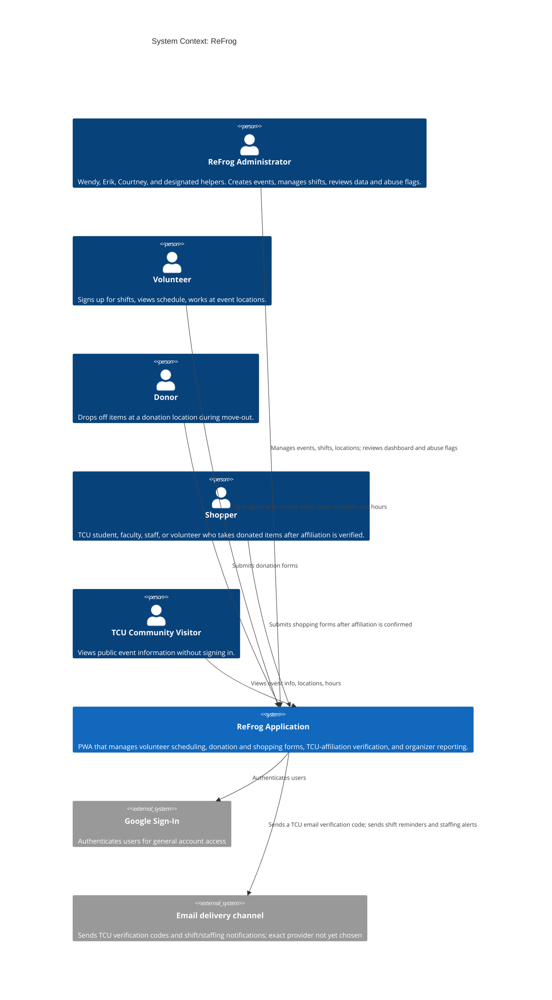
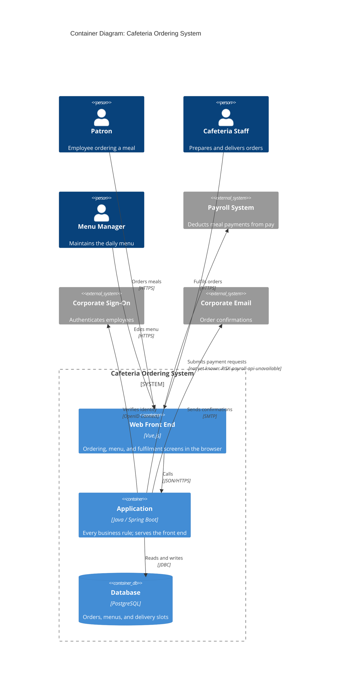
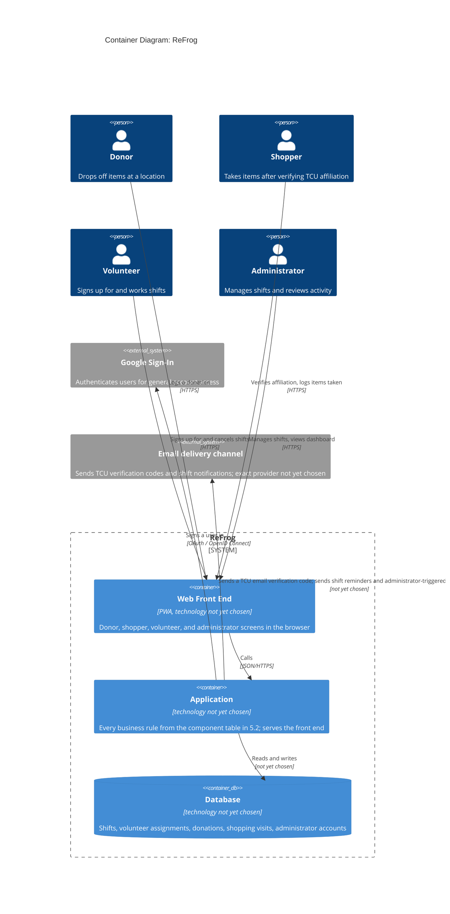

# Architectural Design

**Project:** _[Your project name]_
**Team:** _[Team NN]_
**Client:** _[Client name and organization]_
**Version:** 0.1

---

_**How to use this template.** Instructions appear in italic square brackets. Fill in underneath them and leave them in place until the document is stable. Every section says which checkpoint it is due at. A section that is not due yet stays as it is; do not fill it with guesses to make the document look finished._

_**What this document is.** Your system's **architecture-of-record**: the one map of the whole system, every use case area, every component, every external system, and the few decisions that are expensive to change later. It is **breadth-complete and depth-shallow**. Every part of the system is named, and nothing is designed further than its responsibility. How one use case works inside its component is a design-of-record, which comes in week 7, one per use case area, and it is written against real code._

_**What it is not.** A second copy of your requirements. The specification says what the system must do and how well; this document says how the system is shaped to do it. It **cites** `UC-*`, `CO-*`, `SEC-*`, `PER-*` and the rest by identifier and never restates them. A threshold that appears here and nowhere in the specification is a requirement hiding in the wrong document._

_**The test for what belongs here.** Decide now what is hard to reverse, affects the whole system, and is forced by a quality attribute or a constraint: how many deployables, where the data lives, how users sign in, which external systems you depend on. Leave to per-area design what is local and cheap to change: class names, endpoint shapes, table columns._

_**Structure.** The sections follow **arc42** (Starke and Hruschka), with **C4** diagrams (Simon Brown) for context and containers, written as mermaid so they diff in git. All twelve arc42 sections are here in arc42's order, numbering, and titles. The three subsections whose content another document already owns (the requirements overview, the stakeholders, and the quality requirements overview) are kept as one-line links to that document, so the numbering matches arc42's and nothing is written twice. arc42 orders sections by topic, not by when you write them, so Checkpoint 1 covers sections 1–5, 8, and 9, and sections 6 and 7 come later. The full worked example is Project Pulse's [architecture-of-record](https://github.com/Washingtonwei/project-pulse/blob/main/docs/design/architectural-design.md); read it for the shape, then write your own, because your client's quality attributes are not Project Pulse's.]_

## Identifiers

_[The new identifiers this document creates. Everything else it cites keeps the identifier of the document that owns it.]_

| Space | For | Example |
|---|---|---|
| `KD-<slug>` | Key architectural decisions | `KD-single-deployable` |
| `QS-<slug>` | Quality scenarios | `QS-cross-employee-order-denied` |
| `RISK-<slug>` | Technical risks | `RISK-payroll-api-unavailable` |
| `TD-<slug>` | Technical debt the architecture knowingly carries | `TD-no-rate-limiting` |

_[These are slugs, like every other identifier in your project, so an inserted decision renumbers nothing and a citation says what it points at. Project Pulse uses the same form: `KD-modular-monolith`, `QS-cross-team-denial`.]_

## Revision History

| Version | Date | Author | Change |
|---|---|---|---|
| 0.1 | | | Initial draft for Checkpoint 1 |

---

## 1. Introduction and Goals

_Due: Checkpoint 1._

### 1.1 Requirements overview

_[Your [specification](../requirements/software-requirements-specification.md) and your [use cases](../requirements/use-cases.md) are the requirements overview. Link them here; do not summarize them.]_

The requirements overview is maintained in the [Software Requirements Specification](../requirements/software-requirements-specification.md) and [Use Cases](../requirements/use-cases.md).
### 1.2 Quality goals

_[The **three** quality attributes that most shape your system, in priority order. Pick them from section 9 of your [specification](../requirements/software-requirements-specification.md) and cite their identifiers. If you cannot rank them, ask your client which one they would give up first; that answer is the ranking._

_These are usually the top rows of the table in section 9.1, and the two do different jobs. Here, say why each goal matters to your client. There, say which decision it forces._

_Example, from the Cafeteria Ordering System:]_

| Priority | Quality goal | Specification handles | Why it shapes the architecture |
|---|---|---|---|
| 1 | _Payroll data stays confidential_ | _`SEC-payroll-auth`, `SEC-employee-own-orders`_ | _Orders are paid by payroll deduction, so an order record carries an employee's pay account. A leak is a legal problem, not a bug._ |
| 2 | _Orders placed before 10:00 are not lost_ | _`ROB-order-persisted`, `AVL-lunch-window`_ | _The lunch rush is the only load that matters, and a lost order is a hungry employee with a payroll charge._ |
| 3 | _Cafeteria staff can run it without IT_ | _`CO-no-dedicated-ops`, `MNT-menu-self-service`_ | _Nobody on the cafeteria side can deploy, restart, or patch anything._ |

| Priority | Quality goal | Specification handles | Why it shapes the architecture |
|---|---|---|---|
| 1 | Phone-first participant workflows are quick and accessible | `USE-mobile-responsive`, `USE-donation-completion`, `USE-volunteer-signup-completion`, `USE-validation-feedback`, `USE-accessibility` | Donors, shoppers, and volunteers use the system in busy, distributed event locations. The PWA must work directly from a QR code without making donation or shift sign-up burdensome, while centralizing the workflows that currently use SignUpGenius and QR-code Google Forms. |
| 2 | Shopper affiliation and administrative data are protected | `SEC-authenticated-administration`, `SEC-role-based-access`, `SEC-least-privilege`, `SEC-affiliation-data`, `SEC-transport-encryption`, `SEC-authentication-provider` | Shoppers are verified through their TCU email, while only Wendy Macias, Courtney Hendrix, and Erick Trevino administer event data. The architecture must keep verification and administrative functions separate from public participant workflows. |
| 3 | ReFrog information and essential workflows remain available during event operations | `AVL-event-hours`, `AVL-uptime`, `AVL-fallback-information`, `AVL-outage-recovery` | A service outage during volunteer recruitment or a live event prevents shift coverage, location information, donation logging, and shopping records. The architecture needs reliable hosting, backups, and an accessible outage fallback. |

### 1.3 Stakeholders

_[Your stakeholders are profiled in section 3.1 of [vision and scope](../requirements/vision-and-scope.md). Link it here; do not copy it.]_

Stakeholders are profiled in [Vision and Scope](../requirements/vision-and-scope.md#31-stakeholder-profiles).

## 2. Architecture Constraints

_Due: Checkpoint 1._

_[The constraints the architecture has to honor. They are already written as `CO-*` in section 2.4 of your specification, and `OE-*` in section 2.3; **list the identifiers here, do not restate them.** Add one sentence only where a constraint narrows an architectural choice in a way that is not obvious from its text._

_Your technology stack is a constraint only if something external fixes it: the client's IT department, an existing system, or the person who maintains this after you graduate. A stack your team chose is a decision, and it goes in section 9 with the alternative you rejected.]_

The architecture must honor the following operating-environment requirements: `OE-mobile-location-access`, `OE-in-person-event-support`, and `OE-decentralized-tool-replacement`.

The applicable design and implementation constraints are `CO-nontechnical-administration`, `CO-tcu-it-approval`, `CO-tcu-accessibility`, `CO-tcu-data-governance`, `CO-approved-branding`, and `CO-operational-ownership`.

**Unresolved production hosting.** The team and client have not selected a production hosting provider. `CO-azure-database-hosting` and `CO-tcu-application-hosting` remain conditional constraints pending the client's comparison of TCU-managed hosting with an outside option and any required TCU IT decision. This uncertainty is tracked by `DE-tcu-azure-hosting` and `DE-operational-ownership`.

## 3. Context and Scope

_Due: Checkpoint 1._

_[One C4 context diagram: your system as a single box, every kind of user, and **every external system** it talks to (email, payment, an identity provider, a client database, an LLM, a file store). An external system discovered halfway through the build is a schedule risk you could have seen at the start._

_Your specification already lists the external systems. Every system named in a software interface (`SI-*`, section 8.3), a communications interface (`CI-*`, section 8.5), or a dependency (`DE-*`, section 2.5) is a box here. A box with none of those behind it is an interface your specification is missing, so add it there too._

_This is your project's one context diagram. Section 4.1 of [vision and scope](../requirements/vision-and-scope.md) holds the first draft: redraw it here in C4, then replace the drawing there with a link to this section, so there is one diagram to keep current._

_arc42 divides context into a **business context** (who and what crosses the boundary) and a **technical context** (the channels and protocols). This diagram is the business context. The protocols go on the arrows of the container diagram in section 5.1._

_The **trust boundary** is not drawn here. You name it in writing in section 8.1, as Project Pulse does.]_

### Boundary-crossing relationships

**Users.** Five user types cross the system boundary, matching the user classes in section 2.2 of the [specification](../requirements/software-requirements-specification.md). The sixth class listed there, **Donation-recipient partners**, does not appear on this diagram because their direct use of the application is unresolved (`OI-3`); if they are confirmed as app users, they become a Person box here and a row in section 5.2.

- **ReFrog Administrator** — the three founders and their helpers. They use the admin dashboard (`UC-ADM-view-dashboard`, `UC-ADM-manage-shifts`) to create events, configure shifts and locations, review volunteer coverage, monitor donation and shopping activity, and inspect shopping-abuse flags (`UC-ABU-review-alert`). They are the only users who can export data (`INT-data-export`). Access is gated by `SEC-authenticated-administration` and `SEC-role-based-access`.

- **Volunteer** — signs up for shifts (`UC-VOL-signup`), cancels shifts (`UC-VOL-cancel-shift`), and views their assigned schedule and hours (`UC-VOL-view-schedule`). Must be signed in. Receives shift reminders via the Notification Service (`FR-NOTIFY-shift-reminder`).

- **Donor** — submits a donation form at a drop-off location (`UC-DON-log-donation`). Confirmed under `OI-4` (resolved): no sign-in is required, so the donor does not authenticate through the sign-in provider at all.

- **Shopper** — signs in via Google Sign-In like any other user, then completes an additional, optional TCU-affiliation check (`UC-IDV-verify-affiliation`, `FR-AUTH-affiliation-from-signin`) before submitting a shopping form (`UC-SHP-log-item-taken`). That check is a one-time code sent to a TCU email address the shopper enters — a separate step on top of signing in, not something derived from the Google account itself. The verified confirmation is displayed on the account profile view for in-person verification by a volunteer.

- **TCU Community Visitor** — views public event information (`UC-LOC-view-locations`) without signing in. No data crosses the trust boundary beyond publicly displayed event details.

**External systems.** Two external systems are shown. No external-system integration is committed for the initial release (`SRS §2.1`), but both are architecturally necessary for the features the specification requires:

- **Google Sign-In** — the application delegates general account sign-in to Google Sign-In, the team's chosen provider for any account (TCU-affiliated or not), open to volunteers and administrators alike. The application does not store passwords or issue its own credentials; it consumes an identity token from Google. **Corrected 2026-10-02:** this previously also claimed TCU affiliation was derived from the sign-in email's domain — that part was wrong and is now handled entirely separately, below, as its own optional step on top of sign-in. `SEC-authentication-provider`'s text still frames the choice of authentication *method* as open at the specification level; this diagram reflects the team's working decision to use Google Sign-In specifically, not yet confirmed with the client.

- **Email delivery channel** — the channel through which the application sends a TCU affiliation verification code (`UC-IDV-verify-affiliation`, resolves `OI-10`), shift reminders (`FR-NOTIFY-shift-reminder`), and administrator-triggered volunteer notifications (`UC-ADM-notify-volunteers`). The specific provider is a team decision, not yet made. The system must check notification accuracy before sending (`FR-NOTIFY-current-state`) and must not block business-state changes if a notification fails (`FR-NOTIFY-preserve-business-state`).

**What is not on this diagram.** The current toolchain — SignUpGenius, Google Forms, Google Sheets, and the ReFrog website — does not appear because the application replaces rather than integrates with them (`OE-decentralized-tool-replacement`; `INT-integration-scope`). If any of those tools is later selected for integration rather than replacement, it becomes an external-system box here and needs a corresponding `SI-*` or `CI-*` entry in the specification. The Azure database (`CO-azure-database-hosting`) is internal to the system boundary and appears on the container diagram in section 5.1, not here.

## 4. Solution Strategy

- **ReFrog is a mobile-first progressive web application delivered as one deployable with one persistent database** (`KD-deployment-shape`, section 5.1), keeping participant workflows phone-friendly while minimizing operational complexity for ReFrog's nontechnical administrators (quality goals 1 and 3).

- **The application is divided by use case area** — Volunteer Scheduling, Identity Verification, Location Info, Administration, Shopping-Abuse Monitoring, Shopping, and Donation — with shared Authentication and Notifications components for concerns used across multiple areas (section 5.2).

- **General account authentication is delegated to Google Sign-In, while TCU affiliation is verified separately through a one-time code sent to a TCU email address** (section 8.1, `SEC-authentication-provider`, `UC-IDV-verify-affiliation`), keeping identity and ReFrog-specific shopping eligibility as separate concerns (quality goal 2).

- **Public and participant-facing workflows remain separated from protected administrative operations at the Application trust boundary**, where authentication, authorization, and role-based access are enforced before protected data is returned or changed (section 8.1, `SEC-authenticated-administration`, `SEC-role-based-access`, `SEC-least-privilege`).

- **The initial release replaces the current SignUpGenius, Google Forms, and Google Sheets workflow rather than integrating with those systems**, limiting external dependencies to authentication and email delivery so essential ReFrog workflows remain simpler to operate and recover during event periods (`OE-decentralized-tool-replacement`, quality goal 3).

## 5. Building Block View

_Due: Checkpoint 1. This section is most of what your TA checks._

### 5.1 Containers

_[One C4 container diagram: the separately running or separately stored pieces inside your system box. For most projects that is a front end, a back end, and a database, and sometimes a file store. Name each container's technology. Every external system from section 3 appears again here, attached to the container that talks to it._

_Label every arrow with what it does and the protocol it uses ("Sends confirmations [SMTP]"). Those protocols are arc42's technical context._

_Under the diagram, one or two sentences on **why the system is divided this way**, citing `KD-deployment-shape`. A reader who sees three containers should not have to guess why there are not seven._

_Three containers is a normal answer. If you have more than five, check each one against section 9: which decision, driven by which quality attribute, requires it to run separately?_

_Example:]_

_The system is one application and one database because nobody on the cafeteria side can operate more (`KD-deployment-shape`). The front end is a separate container only because it runs in the browser; it ships inside the application's package._

ReFrog ships as one deployable, reflecting the team's working direction for `KD-deployment-shape` (formal write-up pending §9.2): the three ReFrog founders cannot operate infrastructure, and the team's lack of mobile development experience already ruled out a native app in favor of a single web application. The front end is a separate container only because it runs in the browser as a PWA — it ships inside the application's package, not deployed independently, same as the worked example above.

Technology for all three containers is marked "not yet chosen" deliberately — nothing decided so far commits the team to a specific language, framework, or database, and guessing one here would be exactly the kind of invented precision this document warns against. External systems are provisional pending §3's context diagram.

**Corrected 2026-10-02:** this diagram previously showed Google Sign-In itself deriving TCU affiliation directly from the sign-in email's domain. The client meeting confirmed a different mechanism instead (`OI-10`, resolved): a one-time code sent to a TCU email address the shopper enters, independent of whatever Google account they signed in with. Google Sign-In remains the team's chosen provider for general account access (not yet confirmed with the client); TCU affiliation is a separate, optional step on top of it, not derived from it.

### 5.2 Use case areas and components

_[One row per use case area in your [use cases](../requirements/use-cases.md), taken from the area column of [traceability.md](../traceability.md) section 1, plus one row per **cross-cutting component** that no single area owns (authentication, notifications, file handling, an integration with an external system). A use case area with no row is a part of your system with no home; a component with no area and no cross-cutting reason is one nobody asked for._

_**Responsibility** is one sentence, what the component owns, not how it works. **Depends on** names other components and external systems, never classes. **Status** is `provisional` until the component has been built through at least one use case, and `proven` after that. At Checkpoint 1 every row is `provisional`; Checkpoint 2 turns at least one to `proven`._

_Project Pulse's component tables also name each component's package. They can because its code exists; yours does not yet, so a row here is a name and a responsibility, and packages come with the design-of-record in week 7._

_Example:]_

| Use case area | Component | Responsibility | Depends on | Status |
|---|---|---|---|---|
| _`ORD`_ | _Ordering_ | _Owns an order from placement to cancellation, and the cut-off rules_ | _Menu, Payment, Identity_ | _provisional_ |
| _`MNU`_ | _Menu_ | _Owns daily menus and item availability_ | _Identity_ | _provisional_ |
| _`DEL`_ | _Delivery_ | _Owns delivery slots and the staff's fulfilment queue_ | _Ordering, Notification_ | _provisional_ |
| _(cross-cutting)_ | _Payment_ | _The only component that talks to the Payroll System_ | _Payroll System_ | _provisional_ |
| _(cross-cutting)_ | _Identity_ | _Maps a signed-on employee to a role_ | _Corporate Sign-On_ | _provisional_ |
| _(cross-cutting)_ | _Notification_ | _Sends every email the system sends_ | _Corporate Email_ | _provisional_ |

_[Check before Checkpoint 1: every area in your use case file appears in the first column, and every external system in section 3 appears in some Depends on cell.]_

| Use case area | Component | Responsibility | Depends on | Status |
|---|---|---|---|---|
| `VOL` | Volunteer Scheduling | Owns a volunteer's shift sign-ups, cancellations, and their own schedule and hours | Administration, Authentication, Notifications | provisional |
| `IDV` | Identity Verification | Owns determining whether a signed-in shopper is eligible to shop — TCU-affiliated (confirmed 2026-10-02 via a one-time code sent to a TCU email, not a sign-in domain check) or a registered volunteer | Authentication, Volunteer Scheduling, Email delivery channel | provisional |
| `LOC` | Location Info | Owns the list of active ReFrog locations, hours, and event info shown to every participant | Administration | provisional |
| `ADM` | Administration | Owns shift creation and configuration, manually triggering a notification to volunteers about open shifts (confirmed 2026-10-02, not an automatic alert), and the cross-location dashboard of donation, shopping, and volunteer-coverage activity | Authentication, Volunteer Scheduling, Shopping, Donation, Shopping-Abuse Monitoring, Email delivery channel | provisional |
| `ABU` | Shopping-Abuse Monitoring | Owns flagging and administrator review of potentially-excessive shopping activity | Shopping, Authentication | provisional |
| `SHP` | Shopping | Owns recording what a shopper takes during a visit | Identity Verification, Administration | provisional |
| `DON` | Donation | Owns recording what a donor drops off at a location | Administration | provisional |
| _(cross-cutting)_ | Authentication | Owns signing a user in and recognizing whether that account is one of the three ReFrog administrators | Google Sign-In (external) | provisional |
| _(cross-cutting)_ | Notifications | Owns every reminder and alert the system sends — shift reminders, understaffed-shift alerts | Volunteer Scheduling, an external delivery channel (not yet chosen) | provisional |

`IDV` is kept separate from `Authentication` deliberately: Authentication answers only "who signed in"; Identity Verification is the ReFrog-specific eligibility logic built on top of that (TCU-affiliation-or-volunteer-status), and collapsing the two would bury that business rule inside generic sign-in plumbing.

`Administration` owns shift creation (`UC-ADM-manage-shifts`), not `Volunteer Scheduling`, matching the area assignment already in `use-cases.md`. Volunteer Scheduling reads shift definitions Administration creates; Administration separately reads Volunteer Scheduling's (and Shopping's, Donation's, Shopping-Abuse Monitoring's) data for its dashboard — two distinct, correctly one-directional dependencies rather than a circular one.

`DON`'s dependency on Authentication is intentionally omitted rather than guessed either way, since `OI-4` (whether donation logging requires sign-in) is still open.

One gap this table surfaces rather than silently papers over: no use case currently specifies who configures the base list of active ReFrog locations each year, separate from shift creation. Folded into Administration's responsibility here as the closest fit, but it is not backed by a dedicated use case yet.

## 6. Runtime View

_Due: Checkpoint 2. [One sequence diagram, for the use case your proving slice builds, from the user's action through every container and external system it touches. Leave this section empty until the slice exists; a sequence diagram of code nobody has written describes a guess._

_Draw it as a mermaid `sequenceDiagram`, and name the participants exactly as the containers in section 5.1 name them. If the use case calls an external system, show what happens when that system fails or does not answer; arc42 counts error scenarios among the most useful runtime views. Under the diagram, a sentence or two on anything a reader would not guess from it. Cite the use case by its `UC-*` identifier; do not restate its steps.]_

## 7. Deployment View

_Due: Checkpoint 3. [Filled in once your pipeline exists, after week 11. Three things:_

- _**Where each container runs.** Every container in section 5.1 is mapped to the host, service, or device it runs on, in each environment you have (at least development and production). A table is enough; a diagram helps once there are more than two hosts._
- _**How a change gets there.** From a merged pull request to production: what builds it, what tests it, and where it is released first._
- _**What survives a restart.** Which state is in the database or a file store, and which is lost when the application restarts._

_Section 4.4 of [vision and scope](../requirements/vision-and-scope.md) says who can operate the system and where its users are. Cite it; this section says how the deployment meets it.]_

## 8. Crosscutting Concepts

_[arc42 leaves this section an open list of concepts. This template fixes its first entry, 8.1 Security, because Checkpoint 1 asks for the trust boundary; 8.2 holds every other concept.]_

### 8.1 Security

_Due: named at Checkpoint 1, detailed at Checkpoint 2._

_[Four short paragraphs. The last three each cite the `SEC-*` requirement they answer:_

- _**Trust boundary:** the line between what you control and what you do not. Name the container that is the boundary and what sits outside it (the browser, every external system). Every request that crosses it is authenticated and authorized, and it covers every path your deployable answers, framework endpoints included. Project Pulse's Security & Compliance section shows the shape in three sentences._
- _**Authentication:** how a user proves who they are, and who issues the credential (your system, the client's sign-on, a third party)._
- _**Authorization:** the roles, and the rule for what a user may see beyond their role (a patron sees only their own orders). The second part is where most real breaches happen._
- _**Sensitive data:** what personal or regulated data the system stores, in which container, and which external systems receive any of it. How long it is kept and how it is disposed of are already in section 7.4 of your specification; cite them._

_Secrets (passwords, API keys, connection strings) never appear in this document or in the repository. Say where they will live, not what they are.]_

**Trust boundary.** The `Application` container is the security boundary for ReFrog's business operations. The `Web Front End`, users' browsers and personal devices, the `Sign-in provider`, the TCU email delivery channel, and any other external system are outside that boundary. Public event and location information may be read without authentication, but every request to a non-public endpoint, including framework-provided endpoints, shall be authenticated and authorized before protected data is returned or changed. Network communication containing credentials, affiliation information, or participant records shall use HTTPS (`SEC-authenticated-administration`, `SEC-role-based-access`, `SEC-transport-encryption`).

**Authentication.** Google Sign-In is the current external identity-provider candidate for general ReFrog account authentication (`OI-17`); if selected, the application shall consume Google's identity token or session claims and shall not issue or store user passwords. General sign-in establishes account identity only. A shopper must be signed in before beginning the separate ReFrog-specific affiliation workflow: the shopper enters a TCU email address, receives a one-time code through the external email and notification service, and is marked TCU-affiliated only after the code is successfully verified. This separation allows Google Sign-In, or another approved external identity provider, to coexist with TCU email verification without treating a provider email domain as proof of affiliation (`SEC-authentication-provider`, `UC-IDV-verify-affiliation`, `OI-10`). Donation logging does not require sign-in, because the client confirmed that donors may be unauthenticated and volunteers may submit the form on a donor's behalf (`OI-4`, `UC-DON-log-donation`).

**Authorization.** The application shall enforce role-based access and least privilege after authentication. ReFrog administrators, currently the three founders and any approved designated helpers, may manage event and shift data, view cross-location activity, export authorized data, and review potential shopping abuse. Volunteers may view and manage only their own shift participation and authorized event activity. Shoppers may access their own affiliation confirmation and shopping workflow; donors may submit donation information without an account; and public visitors may access only public event and location information. No participant role may access the administrator dashboard or another participant's records, and suspected shopping-abuse information is restricted to authorized administrators (`SEC-role-based-access`, `SEC-least-privilege`, `SEC-administrator-review`, `FR-AUTH-enforce-permissions`).

**Sensitive data.** The `Database` may contain external-provider account references, TCU email addresses used for verification, affiliation-verification status, volunteer assignments, donation and shopping records, administrator changes, and shopping-abuse review information. The system shall not require or store a raw TCU ID number; if a shopper cannot access TCU email, the volunteer may use the existing visual ID fallback without entering the ID into ReFrog (`SEC-affiliation-data`, `UC-IDV-verify-affiliation`, SRS §7.4.5). The application sends a TCU email address and one-time verification code through the external email and notification service, while general authentication data is handled by the selected identity provider. Secrets such as passwords, API keys, and connection strings shall live only in the approved deployment secret store, never in this document, source control, logs, exports, or error responses. Retention, disposal, backup purge, and authorization to dispose of these records remain subject to client and TCU approval (`CO-tcu-data-governance`, SRS §§7.4.3-7.4.5, `OI-6`).

### 8.2 Other concepts

_Due: Checkpoint 1, a subsection for every concept in the table below; then kept current, adding the file that shows each rule once code exists and a new concept whenever one appears. [Anything every component must do the same way. Your agent starts every session with no memory of the last, so a convention that is not written here gets reinvented each time. Write every concept now, while each is still cheap to choose; the last column says when a missing one would start to hurt._

_One short subsection each: the rule in one sentence, why, and the file that shows it done right once one exists. Put the one-line instruction in your charter too, citing this subsection, because the charter is what your agent always reads. Project Pulse's Crosscutting Concepts section is a worked example; its headings differ from this template's._

| Concept | The question it settles | When it usually bites |
|---|---|---|
| _Error handling_ | _What does a failure look like to the caller, and where is it caught?_ | _The second endpoint_ |
| _Time and time zones_ | _Whose clock decides a deadline, what zone is stored, and can a test set the time?_ | _The first deadline or "submitted late"_ |
| _API conventions_ | _What shape does every response take, and how are endpoints named?_ | _The second endpoint_ |
| _Code conventions_ | _Which libraries and idioms does every file use, and which are banned? (Formatting belongs to a formatter, not here.)_ | _The first file an agent writes_ |
| _Validation_ | _Where is input checked, and which check is the one that counts?_ | _The first form_ |
| _Configuration and secrets_ | _What differs between development and production, and where does it live?_ | _The first deploy_ |
| _Logging_ | _What is logged, at what level, and what must never be?_ | _The first bug you cannot reproduce_ |
| _Persistence and concurrency_ | _Where does a transaction begin and end, and what happens when two people edit at once?_ | _The first shared record_ |
| _Auditing_ | _Who changed what, and when?_ | _The first "who did this?"_ |
| _Testing_ | _Which kinds of test, at which layer, with what data?_ | _The first pull request_ |

Due: Checkpoint 1. These conventions apply across all components and remain provisional where the implementation or a client policy decision has not yet been selected.

**8.2.1 Error handling.** The application shall distinguish validation failures, authorization failures, unavailable services, and unexpected failures in a consistent response that does not expose credentials, connection strings, stack traces, or unnecessary personal data. Failed submissions shall be reported as not recorded unless persistence has been confirmed, and entered values should remain available for retry where the interface supports it. This supports `FR-SAVE-confirmed-success`, `ROB-submission-status`, `ROB-invalid-input`, `ROB-external-service-failure`, and `ROB-connectivity-loss`. Shown in: the first shared application error handler and its integration tests.

**8.2.2 Time and time zones.** ReFrog event dates and times shall use the `America/Chicago` time zone, timestamps shall be stored in a consistent machine-readable form, and user-facing times shall be converted to the configured event time zone and displayed using a 12-hour clock with `a.m.` or `p.m.`. Tests shall be able to provide a fixed clock when behavior depends on a deadline. This supports `LOC-event-time-zone`, `LOC-time-storage`, and `LOC-time-display`. Shown in: the first time utility and time-dependent tests.

**8.2.3 API conventions.** Public information and protected participant workflows shall use consistent resource naming, structured success and error responses, documented status codes, and an API contract generated or maintained from the implementation. The exact framework, endpoint names, response schema, and API documentation location remain provisional until the containers and technology stack are selected. The contract shall preserve the validation and failure behavior required by `FR-VAL-server-validation`, `FR-VAL-field-feedback`, `FR-SAVE-confirmed-success`, and `ROB-submission-status`. Shown in: the API contract and the first endpoint integration tests.

**8.2.4 Code conventions.** The implementation shall use one agreed formatter, linter, naming convention, dependency-management approach, and test organization across components. Shared business rules shall not be duplicated between participant interfaces and server-side operations. The specific language, framework, formatter, and banned-library list remain provisional until the team records the technology decisions. This supports `MNT-automated-tests`, `MNT-dependency-record`, and `MNT-operational-handoff`. Shown in: the repository formatter/linter configuration and contribution instructions.

**8.2.5 Validation.** Validation shall occur on the server before data is stored, including required fields, data types, positive item counts, and references to active ReFrog locations or other valid records. Interfaces shall identify the invalid field, explain the correction, and preserve valid entered values. Client-side validation may improve feedback but is not the authoritative check. This implements `FR-VAL-server-validation`, `FR-VAL-field-feedback`, `FR-VAL-preserve-input`, and `ROB-invalid-input`. Shown in: shared validation tests that submit invalid requests without using the interface.

**8.2.6 Configuration and secrets.** Environment-specific settings shall be supplied through deployment configuration rather than source code, and credentials, API keys, and connection strings shall be stored in the approved secret-management facility for the selected hosting environment. Secrets shall not appear in this document, source control, logs, exports, or error responses. The hosting provider, secret-management product, service-account owner, and production configuration are unresolved under `CO-operational-ownership`, `DE-tcu-azure-hosting`, and `DE-operational-ownership`. Shown in: deployment configuration documentation and a checked-in example containing placeholders only.

**8.2.7 Logging.** Logs shall support diagnosis of failed requests and external-service failures while excluding authentication secrets, raw TCU ID numbers, unnecessary affiliation data, and other unnecessary personal information. Log levels and retention shall be chosen with the operational owner and data-governance requirements; no retention period is invented here. This supports `MNT-diagnostics`, `SEC-affiliation-data`, `SEC-transport-encryption`, and SRS section 7.4. Shown in: the shared logging configuration and log-redaction tests.

**8.2.8 Persistence and concurrency.** Each accepted donation, shopping, volunteer, event, location, and partner-pickup change shall be persisted only after the applicable validation and business rules succeed. A transaction shall cover the smallest complete business operation, and a failed write shall not be reported as successful. The database technology, transaction mechanism, duplicate-submission strategy, and behavior when two administrators edit the same record remain provisional; the current requirements require prevention of unintended duplicate records but do not define a broader conflict-resolution policy. This supports `FR-SAVE-confirmed-success`, `ROB-duplicate-submission`, `ROB-invalid-input`, `ROB-backup-recovery`, and `BR-shopping-activity-recorded`. Shown in: persistence integration tests and the first database transaction boundary.

**8.2.9 Auditing.** The system shall record successful and unsuccessful administrator authentication attempts and administrator changes to event, schedule, and participant records, consistent with `SEC-audit-log`. The initial release shall not add a separate general-purpose audit subsystem beyond that minimum requirement unless the client or TCU approves the additional scope. Audit records shall not contain secrets or unnecessary sensitive data, and their retention and disposal remain subject to SRS section 7.4 and `OI-6`. Shown in: the administrator audit events and their integration tests.

**8.2.10 Testing.** Automated tests shall cover authentication and authorization, volunteer scheduling, shared validation, data-calculation rules, duplicate-submission behavior, time-zone behavior, and persistence failure handling. Tests shall use representative but non-production data and shall verify both successful and rejected requests. The test framework and exact test-layer split remain provisional until the technology stack is selected. This supports `MNT-automated-tests`, `MNT-diagnostics`, `FR-AUTH-enforce-permissions`, `FR-VAL-server-validation`, `ROB-duplicate-submission`, and `ROB-backup-recovery`. Shown in: the repository test suite and its test-data guidance.

## 9. Architecture Decisions

_Due: the table and one decision at Checkpoint 1; more as they are made._

### 9.1 Architecturally significant requirements

_[Not every requirement shapes the architecture. The **architecturally significant requirements** are the few that do: quality attributes and constraints where a wrong guess costs a redesign, not a bug fix. Functionality can be delivered by many structures; these are what choose among them._

_Your quality goals from section 1.2 are usually the top rows; cite them by identifier and do not explain them again. This table can also hold what is nobody's goal but still forces structure, such as a `CO-*` constraint._

_List three to six, ranked by importance to your client times difficulty to achieve. Reuse the specification's identifiers, never new ones. **At least one row is a `SEC-*` attribute.** Every system your team builds this year holds some personal data, and if no security requirement appears here, that data's protection was never designed; it will be added later, which is where security bugs come from.]_

| Rank | Requirement | Specification handles | Importance × difficulty | Drives |
|---|---|---|---|---|
| 1 | Phone-first participant workflows are quick and accessible | `USE-mobile-responsive`, `USE-donation-completion`, `USE-volunteer-signup-completion`, `USE-validation-feedback`, `USE-accessibility` | High × High | The PWA client container and QR-code entry path |
| 2 | Shopper affiliation and administrative data are protected | `SEC-authenticated-administration`, `SEC-role-based-access`, `SEC-least-privilege`, `SEC-affiliation-data`, `SEC-transport-encryption`, `SEC-authentication-provider` | High × High | The section 8.1 trust boundary, TCU-email authentication boundary, and Identity component |
| 3 | ReFrog information and essential workflows remain available during event operations | `AVL-event-hours`, `AVL-uptime`, `AVL-fallback-information`, `AVL-outage-recovery`, `ROB-submission-status`, `ROB-duplicate-submission`, `ROB-connectivity-loss` | High × Medium | `KD-deployment-shape`, persistent storage, duplicate-safe submission handling, backup and recovery, and outage-fallback responsibilities |
| 4 | The system remains operable by nontechnical administrators and maintainable after team handoff | `CO-nontechnical-administration`, `CO-operational-ownership`, `MNT-event-configuration`, `MNT-deployment-documentation`, `MNT-operational-handoff` | High × Medium | `KD-deployment-shape` and the configuration and operational boundaries |

### 9.2 Key decisions

_[One entry per key decision (`KD-*`), in the form below; it is what the wider industry calls an architecture decision record (ADR). Checkpoint 1 requires exactly one: **`KD-deployment-shape`**, whether your system ships as one deployable or several, and why. Every team makes this decision, and it is where over-engineering usually shows up first. Add others when you make them; do not invent them to fill the section._

_A decision without a **rejected alternative** is not a decision, it is a description. Name what you did not do and why not, so the next person does not redo the argument._

_A decision that turns out wrong is not deleted or rewritten. Mark it **Superseded by `KD-<new-slug>`** and write the new decision as its own entry, so the reasoning behind both stays readable._

_Example:]_

**`KD-deployment-shape`: one deployable modular application.** _Accepted._

- **Driving requirements:** `AVL-uptime`, `AVL-outage-recovery`, `CO-operational-ownership`, `MNT-deployment-documentation`, and `MNT-operational-handoff`.
- **Context:** ReFrog's event-scale workload is bounded by `SCA-event-capacity`: at least eight active locations, 200 volunteers, 3,000 shoppers, and 10,000 item-activity records per event. The three nontechnical ReFrog founders cannot operate multiple application services, and the long-term maintenance owner is not yet settled. Section 5.2 still requires clear internal ownership for every use-case area and cross-cutting responsibility.
- **Decision:** Build the use-case-area and cross-cutting components from section 5.2 as modules inside one application. Build the PWA front end into that application's package and release both as one deployable artifact to one application-hosting target. Keep persistent data in the single database container shown in section 5.1. The application framework, database technology, and production hosting provider remain open decisions.
- **Rejected:** Deploying the PWA independently from the application, or deploying the use-case areas as separate services. Either alternative would add deployment pipelines, network calls, distributed authentication and authorization, cross-service data coordination, and additional failure modes without a requirement for independent release or scaling.
- **Trade-off:** The application is released and scaled as a whole, and an application failure can interrupt every workflow. This decision must be revisited if a future requirement demands independent scaling, deployment, security isolation, or availability for one part of the system.

## 10. Quality Requirements

### 10.1 Quality requirements overview

_[Section 9 of your [specification](../requirements/software-requirements-specification.md) is the overview. Link it here; do not copy it.]_

### 10.2 Quality scenarios

_Due: one scenario at Checkpoint 2; one per top-ranked requirement in section 9.1 by Checkpoint 3._

_[A quality attribute says how good; a scenario says how you will know. Each one is: a **source** does a **stimulus** in an **environment**, the system gives a **response**, and a **measure** tells you it worked. The measure cites the specification's attribute for its number; it never introduces one._

_**Verified by** names the test, or the repeatable manual check, that shows the measure holds. Leave it empty until that test exists; an empty cell is an honest "not yet verified".]_

| ID | Source and stimulus | Environment | Response | Measure | Verified by |
|---|---|---|---|---|---|
| _`QS-cross-employee-order-denied`_ | _A signed-on patron requests another patron's order by its ID_ | _Normal operation_ | _Refused before any order data is read_ | _Every such request is refused and returns no order fields (`SEC-employee-own-orders`)_ | _An integration test that signs in as one patron and requests another patron's order_ |

## 11. Risks and Technical Debt

_Due: Checkpoint 2, kept current after._

_[**Technical** risks and debt only. Business risks are `RI-*` in [vision and scope](../requirements/vision-and-scope.md); do not copy them here. Project risks, such as a teammate dropping the course, belong in neither document. Seed this list from the technical `RI-*` items and from any [OPEN-ISSUES.md](../requirements/OPEN-ISSUES.md) entry whose answer could change the architecture._

_A **risk** might happen: an external system you have never called, a client dataset you have never seen. **Debt** has already happened: a shortcut you took on purpose and intend to pay back. Each row says how you would find out, or how you would fix it._

_A risk written as a category ("security", "performance") is not a risk. Write the mechanism: what fails, and what that breaks.]_

| ID | Type | What could go wrong, and what it breaks | Mitigation or fix | Cites |
|---|---|---|---|---|
| _`RISK-payroll-api-unavailable`_ | _Risk_ | _Nobody has seen the Payroll System's interface. If it only accepts a nightly batch file, ordering cannot confirm payment at order time._ | _Ask for the interface document at the next client meeting; build Payment against a stub until then._ | _`DE-payroll-integration`, `OI-4`_ |

## 12. Glossary

_[Domain terms live in your [project glossary](../requirements/project-glossary.md). Link it and add nothing here unless you need an architecture term your team uses in a special sense.]_

---

## Working this document with your agent

_[Delegate: drawing the C4 diagrams in mermaid from your use case list and your specification's interfaces; checking that every use case area has a component and every external system has a component that depends on it; checking that every identifier this document cites exists in the document that owns it; drafting the rejected alternative for a decision you have already made._

_Keep human: the ranking in section 9.1 and every `KD-*`. The decisions are the part of this document your client and the team that inherits this system will hold you to, and they depend on facts about your client that are not in any file._

_**The specific failure to watch for: over-engineering.** Ask an agent for an architecture and it will propose the one it has seen most often in writing, which is built for a company a thousand times your size: microservices, a message queue, Kubernetes, a cache in front of a database that holds ten thousand rows. Every one of those is a real answer to a problem you do not have, and each one adds something that can break at 2 a.m. with nobody to fix it. For every container and every decision the agent proposes, ask which requirement in section 9.1 forces it. If the answer is none, cut it.]_
