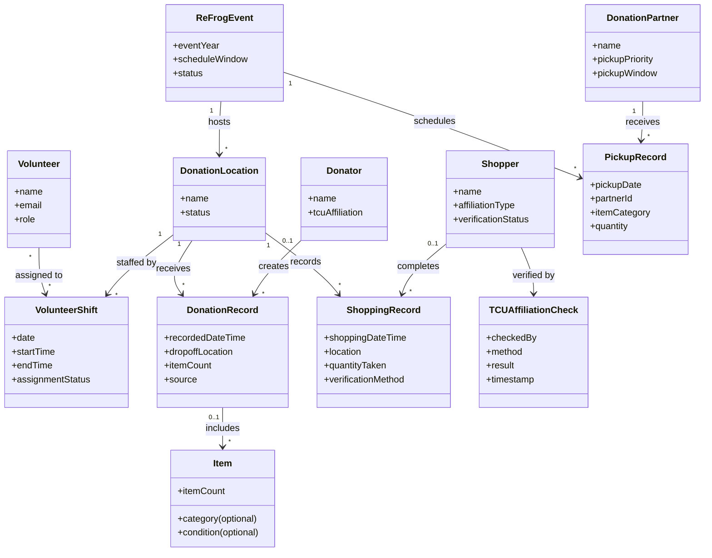

# Software Requirements Specification

**Project:** _[Your project name]_
**Team:** _[Team NN]_
**Client:** _[Client name and organization]_
**Version:** 0.1

---

_**How to use this template.** Instructions appear in italic square brackets. Fill in underneath them and leave them in place until the document is stable._

_**What this document is, and what it is not.** The specification describes the external behavior of your system completely enough that a developer can build it and a tester can check it. What it is **not** is a container for everything you have written. Your glossary, vision and scope, use cases, and business rules are separate documents with their own identifiers, and this one **links to them rather than repeating them**._

_That makes the specification mostly a hub. Read that as a feature. One fact, one home: a business rule copied in here is a business rule that will disagree with `business-rules.md` by October, and nobody will notice which copy is right. The sections below that say "link to" are supposed to be short._

_What this document owns outright: the requirements that have no other home. Functional requirements that are not part of any use case, quality attributes, external interfaces, data requirements, operating environment, and constraints._

## Identifiers

_Every requirement in this document carries a name-based slug. Create only the spaces your project actually needs._

| Space | For | Example |
|---|---|---|
| `FR-<AREA>-<slug>` | Functional requirements outside any use case | `FR-SAVE-autosave-active` |
| `UI-<slug>` | User interface requirements | `UI-spa-views` |
| `SI-<slug>` | Software and system interfaces | `SI-llm-proxy-only` |
| `CI-<slug>` | Communications interfaces | `CI-email-notifications` |
| `DI-<slug>` | Data requirements | `DI-persist-graph` |
| `OE-<slug>` | Operating environment | `OE-supported-browsers` |
| `CO-<slug>` | Design and implementation constraints | `CO-single-application` |
| `AS-<slug>` / `DE-<slug>` | Assumptions and dependencies | `AS-supported-browser`, `DE-llm-service` |

_Quality attributes get one space per attribute, so the identifier says which kind of quality it is at the place it is cited: `USE-` usability, `PER-` performance, `SEC-` security, `SAF-` safety, `AVL-` availability, `ROB-` robustness, `SCA-` scalability, `INT-` interoperability, `MNT-` maintainability._

_Requirements cited from elsewhere keep their own identifiers: `UC-*` from [use-cases.md](use-cases.md), `BR-*` from [business-rules.md](business-rules.md), `BO-*`, `SM-*`, `FEAT-*` from [vision-and-scope.md](vision-and-scope.md)._

## Revision History

| Date | Version | Description | Author |
|---|---|---|---|
| _[YYYY-MM-DD]_ | 0.1 | Initial draft | _[Name]_ |

---

## 1. Introduction

### 1.1 The purpose of _[project name]_

_[What the system is for: who wants it, why, and who will use it. Even though the vision and scope answers this, restate it in a paragraph here, because people read this document without having read that one.]_

### 1.2 The purpose of this document

_[What this specification covers and for which release.]_

_Example: "This document describes the functional and nonfunctional requirements for release 1.0 of the Cafeteria Ordering System. It serves as the reference for the project's requirements, defining the scope, functionality, and constraints for stakeholders, developers, and testers."]_

### 1.3 Document conventions

_[Any typographical conventions, and the identifier formats above, so that someone adding a requirement later knows how to name it.]_

### 1.4 References

_[Every document this specification refers to, with a link. At minimum, the four other documents in this folder. Include external standards you must conform to.]_

- _[Project glossary](project-glossary.md)_
- _[Vision and scope](vision-and-scope.md)_
- _[Use cases](use-cases.md)_
- _[Business rules](business-rules.md)_
- _[Open issues](OPEN-ISSUES.md)_
- _[The Easy Approach to Requirements Syntax (EARS)](https://alistairmavin.com/ears/)_

---

## 2. Overall Description

### 2.1 Product perspective

_[How this system relates to other systems and to the user's environment. Self-contained, or one component of something larger? Link to the product perspective section of your vision and scope and to your architecture's context diagram rather than redrawing them.]_

### 2.2 User classes and characteristics

_[The kinds of user, and what distinguishes them: frequency of use, technical skill, privilege level, whether they are inside or outside the client's organization. Link to the stakeholder profiles in your vision and scope; what belongs here is what affects the software's behavior, especially permissions.]_

### 2.3 Operating environment

_[The environment the software runs in: hardware, operating systems and versions, browsers, where users and servers are located, and any other software it has to coexist with.]_

_Examples:_

- _`OE-supported-browsers`: The system shall operate correctly on the current and previous major versions of Chrome, Firefox, Safari, and Edge._
- _`OE-server-platform`: The system shall run on a server running the current corporate-approved version of Linux._
- _`OE-access-paths`: The system shall permit access from the corporate intranet, from a VPN connection, and from Android and iOS phones and tablets._

### 2.4 Design and implementation constraints

_[Anything that limits the developers' options: corporate or regulatory policy, hardware limits, required languages or databases, coding standards, interfaces to other applications.]_

_Examples:_

- _`CO-database-engine`: The system shall use the corporate standard database engine._
- _`CO-language-version`: The backend shall be written in Java 21._
- _`CO-coding-standard`: Design, code, and maintenance documentation shall conform to the client's development standard._

_The constraint students forget: **who maintains this after you graduate, and what do they already know how to run?** If the answer is one person who knows Python, a Spring Boot service is a constraint violation nobody wrote down._

### 2.5 Assumptions and dependencies

_[An assumption is a factor you believe true without proof, which would change these requirements if it turned out false. A dependency is something outside your control that the project relies on: an external API, a third-party library, a change someone else has to make.]_

_Examples:_

- _`AS-supported-browser`: Users access the system with a browser that supports the ECMAScript version the frontend targets._
- _`DE-payroll-integration`: Operation depends on changes being made in the Payroll System to accept payment requests for meals ordered through this system._

---

## 3. Project Glossary

_[Link only. The glossary is [project-glossary.md](project-glossary.md).]_

## 4. Vision and Scope

_[Link only. Business requirements, objectives, metrics, and scope live in [vision-and-scope.md](vision-and-scope.md).]_

---

## 5. Functional Requirements

### 5.1 Use cases

_[Link to [use-cases.md](use-cases.md). Most of your system's behavior is specified there, as use cases, and it does not get restated here.]_

### 5.2 Non-use-case functional requirements

_[Behavior that is real, testable, and belongs to no single use case: autosave, validation applied everywhere, notification, authorization, audit logging. If you find yourself writing the same step into six use cases, it belongs here instead._

_Group them under sub-headings by concern, and write each one using an [EARS](https://alistairmavin.com/ears/) shape so that it cannot be read two ways:_

- _**Ubiquitous:** The `<system>` shall `<response>`._
- _**Event driven:** When `<trigger>`, the `<system>` shall `<response>`._
- _**State driven:** While `<in a state>`, the `<system>` shall `<response>`._
- _**Optional:** Where `<feature is included>`, the `<system>` shall `<response>`._
- _**Unwanted behavior:** If `<precondition>`, then the `<system>` shall `<response>`._

_Example: `FR-SAVE-autosave-active`: While a student is editing a weekly activity report during an active week, the system shall persist the draft every 30 seconds._

_**Every requirement here needs an oracle.** If you cannot say how a tester would tell whether it holds, it is not a requirement yet.]_

---

## 6. Business Rules

_[Link only, to [business-rules.md](business-rules.md). Business rules are a rich source of requirements because they dictate properties the system must have in order to conform to them, but the rules themselves are properties of the client's business, not of your software, and they have their own document.]_

---

## 7. Data Requirements

### 7.1 Business domain model

The ReFrog domain centers on a seasonal move-out event, staffed physical donation locations, donations that are counted and later sorted, shoppers who are checked for TCU affiliation, and donation partners who receive remaining usable items. The following model reflects the business concepts.

### 7.2 Data dictionary

The following dictionary identifies the core business data the system must manage. It is organized around the ReFrog domain terms used in the project brief, glossary, and business rules, and it excludes implementation-only database identifiers unless they are required for business traceability.

| Entity | Field | Data type | Allowed values / default | Validation / business rule |
|---|---|---|---|---|
| ReFrogEvent | eventId | String / UUID | Unique per event | Required; each record must map to one event season or event window. |
|  | eventYear | Integer | Current academic year or move-out cycle | Required; should match the event's move-out period. |
|  | scheduleWindow | Date range | Monday-Saturday during finals week, approx. 2:00 p.m. start | Must align with the operational schedule defined by the committee. |
|  | status | Enum | planned, active, closed, archived | Required; only active records may accept live submissions. |
| DonationLocation | locationId | String | Unique site identifier | Required; one location per operational site. |
|  | name | String | Site name or code | Required; human readable and unique within the event. |
|  | status | Enum | open, closed, maintenance, capacity | Required; a closed location must not accept new activity. |
| Volunteer | volunteerId | String | Unique volunteer identifier | Required; may be internal or a user account identifier. |
|  | name | String | Free text | Required; non-empty. |
|  | email | String | Valid email format | Optional if not used for assignments, but required for notifications. |
|  | role | Enum | organizer, staff, site volunteer, community volunteer | Required; used to distinguish operational assignments. |
| VolunteerShift | shiftId | String | Unique shift identifier | Required. |
|  | date | Date | Event date | Required; must fall within the active event window. |
|  | startTime / endTime | Time | HH:MM local time | Required for a scheduled shift; end time must be after start time. |
|  | assignmentStatus | Enum | assigned, claimed, cancelled, filled | Required to support last-minute replacement workflows. |
| Donator | donatorId | String | Unique donor identifier if personal data is retained | Optional; keep only if needed for follow-up and not as a raw ID unless approved. |
|  | name | String | Free text | Optional for anonymous or low-friction drop-off records. |
|  | affiliation | Enum | TCU student, faculty, staff, community, unknown | Optional; used only where it affects the donation process. |
| DonationRecord | donationRecordId | String | Unique record identifier | Required. |
|  | recordedDateTime | DateTime | Local time | Required; recorded at the time of drop-off. |
|  | dropoffLocation / locationId | String | Existing DonationLocation.locationId | Required; each donation must be associated with the site of receipt. |
|  | itemCount | Integer | 0 or greater | Required; must represent the number of items donated in the submission. |
|  | source | Enum | QR scan, manual entry, admin entry | Required; distinguishes how the donation was logged. |
| Item | category / itemGroup | String | Furniture, appliance, clothing, linens, household goods, other | Required for category-level tracking; may be used for partner pickup prioritization. |
|  | itemCount | Integer | 1 or greater | Required when item-level quantities are tracked. |
|  | condition | Enum | usable, damaged, uncertain | Required when item quality is recorded; otherwise may default to usable if not assessed. |
| Shopper | name / shopperId | String | Unique shopper identifier | Required if the system tracks repeat visits or abuse patterns. |
|  | affiliationType | Enum | student, faculty, staff, volunteer, not-eligible | Required; used to determine shopping eligibility. |
|  | verificationStatus | Enum | verified, unverified, rejected, review-needed | Required; ties to the TCU affiliation check process. |
| ShoppingRecord | shoppingRecordId | String | Unique record identifier | Required. |
|  | shoppingDateTime | DateTime | Local time | Required. |
|  | locationId | String | Existing DonationLocation.locationId | Required. |
|  | quantityTaken | Integer | 0 or greater | Required; must record number of items removed in the visit. |
|  | verificationMethod | Enum | visual ID check, digital check, admin override | Required; supports audit and abuse review. |
| TCUAffiliationCheck | checkId | String | Unique verification record | Required. |
|  | checkedBy | String | Volunteer or staff member name or ID | Required when performed by a person. |
|  | method | Enum | physical ID, phone ID, staff confirmation, other | Required; source of the verification result. |
|  | result | Enum | eligible, ineligible, needs review | Required; ineligible or needs-review shoppers must not be approved to shop. |
|  | timestamp | DateTime | Local time | Required. |
| DonationPartner | partnerId | String | Unique partner identifier | Required. |
|  | name | String | Partner organization name | Required; examples include Wellman Project, TRIO, Archway. |
|  | pickupPriority | Integer | 1, 2, 3, ... | Required to reflect pickup order. |
|  | pickupWindow | Date range | Pickup dates during or immediately after event week | Required; should match the agreed partner pickup schedule. |
| PickupRecord | pickupRecordId | String | Unique record identifier | Required. |
|  | pickupDate | Date | Event week date | Required. |
|  | partnerId | String | Existing DonationPartner.partnerId | Required. |
|  | itemCategory | String | Category or item class received | Required if the report documents what each partner took. |
|  | quantity | Integer | 0 or greater | Required; must match count available at handoff. |

Notes:

- The current process logs donor and shopper activity through QR-code forms, so the system should preserve source metadata and use a consistent event-location combination for all submissions.
- A raw TCU ID number is not required to satisfy the system's business needs and should be kept only if the client specifically approves it; the system should prioritize a verification result and audit trail over storing a full ID value.
- Where a field is already defined in a use case or business rule, that use case or rule remains the authoritative validation source rather than a second, conflicting definition in this document.

### 7.3 Reports

The system shall generate operational and reporting data in a format that can be used by ReFrog organizers, volunteer managers, and partner coordinators without manually reconciling multiple disconnected spreadsheets. The reports below represent the minimum core reporting set needed to support the current process and address the known pain points described in the client brief and the vision and scope.

#### 7.3.1 Daily site activity report

- Who reads it: ReFrog organizers and the volunteer staff at each donation location.
- What it contains: donated item counts by location, shopping counts by location, date/time of activity, site status, and any verification or review events.
- Frequency: generated daily during the event and available after each operational day.
- Format: dashboard view and downloadable CSV or spreadsheet export.
- Purpose: gives organizers a single source of truth for site activity while the event is still running.

#### 7.3.2 Volunteer staffing and coverage report

- Who reads it: ReFrog organizers and volunteer coordinators.
- What it contains: assigned volunteers, claimed and unfilled shifts, cancellation status, location coverage, and open staffing gaps by time block.
- Frequency: updated in near real time for the event window and summarized after the event.
- Format: schedule dashboard and printable staffing summary.
- Purpose: reduces the risk that a single founder must personally absorb late cancellations and helps the committee plan replacement coverage.

#### 7.3.3 Donor and shopper activity summary

- Who reads it: ReFrog organizers and the TCU Sustainability Committee.
- What it contains: total donations by site, total shopping visits by site, number of items donated, number of items taken, and totals by day or time range.
- Frequency: generated daily and at the end of the event.
- Format: summary table and chart view with export to spreadsheet.
- Purpose: supports the impact metrics the program reports to the university and external partners.

#### 7.3.4 Shopping abuse review report

- Who reads it: ReFrog organizers or designated administrators.
- What it contains: repeated shopping visits by the same shopper, counts by location over time, verification status, and any review flags that require staff intervention.
- Frequency: generated during the event or on-demand when a potential abuse pattern is detected.
- Format: table-based review list with flags and supporting event history.
- Purpose: supports the current business rule that suspected excessive or prohibited shopping must be reviewed before action is taken.

#### 7.3.5 Donation partner handoff and reconciliation report

- Who reads it: ReFrog organizers and each donation partner.
- What it contains: partner name, pickup date, pickup order, category mix, total items handed off, and any variance between expected and actual pickup volume.
- Frequency: generated at each pickup window and summarized after the event.
- Format: reconciliation table and downloadable report.
- Purpose: allows ReFrog and partner organizations to compare planned and actual handoff volumes and resolve discrepancies like the Archway shortfall described in the client brief.

#### 7.3.6 Year-end impact report

- Who reads it: the TCU Sustainability Committee, client stakeholders, and event supporters.
- What it contains: annual totals for volunteers, volunteer hours, donation sites, donation counts, shopping counts, diverted items, and partner handoff totals, as approved by the committee for public reporting.
- Frequency: generated once per event cycle, usually at the end of the move-out season.
- Format: spreadsheet-ready summary or presentation-friendly dashboard.
- Purpose: replaces the current hand-reconciled Google Sheets process and reduces the "unknown amount of error" described by the client.

### 7.4 Data acquisition, integrity, retention, and disposal

[Where the data comes from, how it is kept correct, how long it is kept, and how it is destroyed. If your system holds anything about students or other identifiable people, this section is not optional, and its content is usually a business rule you should cite rather than invent.]

This section distinguishes the data-handling behavior required to support the business rules from retention and disposal policies that ReFrog has not yet established. The authoritative business rules are maintained in [business-rules.md](business-rules.md); this section cites those rules rather than restating them as new policy.

#### 7.4.1 Data acquisition

- The system shall record the ReFrog location and item count for each donation submission, as required by `BR-donation-location-recorded` and `BR-donation-count-recorded`.
- The system shall record the event date, location, and number of items taken for each shopping visit, as required by `BR-shopping-activity-recorded`.
- The system shall record the result of the TCU-affiliation check before permitting a person to shop, as required by `BR-shopper-verification` and `BR-shopper-tcu-affiliation`. The specific electronic verification method is unresolved by the business rules.
- The system shall record volunteer assignments against the location and shift the volunteer has claimed or been assigned, as required by `BR-volunteer-assignment`. The business rules do not yet define the complete cancellation and reassignment workflow.
- The system shall record remaining-item handoffs to donation partners in the agreed pickup order and according to item priorities, as required by `BR-partner-pickup-priority` and `BR-remaining-items-distributed`.

#### 7.4.2 Data integrity

- Each donation record shall remain associated with the physical ReFrog location where it was received, in accordance with `BR-donation-location-recorded`.
- Each shopping record shall contain the event date, location, and item count required by `BR-shopping-activity-recorded`.
- The system shall not accept a shopping record as an approved shopping activity unless the shopper has demonstrated TCU affiliation, in accordance with `BR-shopper-verification` and `BR-shopper-tcu-affiliation`.
- The system shall preserve the pickup order and item priorities used for partner handoffs, in accordance with `BR-partner-pickup-priority`.
- The system shall route suspected excessive or prohibited shopping to ReFrog administrator review before applying any action, in accordance with `BR-shopping-abuse-review`. The threshold and penalty for abuse remain unresolved and shall not be invented by the system.
- The system shall preserve the distinction between free shopping and any other transaction type; ReFrog shopping is without charge under `BR-free-shopping`.

The business-rules document does not currently define general record identifiers, duplicate-detection rules, correction history, reconciliation formulas, or backup integrity requirements. Those are implementation or policy decisions and require confirmation before they are made mandatory requirements.

#### 7.4.3 Retention

No retention period is currently specified in `business-rules.md`. The rules document defines the operational data that must be recorded, but it does not state how long donation, shopping, volunteer, affiliation-check, or partner-pickup records must be kept.

- **Open decision:** ReFrog and TCU must define retention periods for operational records and any personally identifiable information before production use.
- **Open decision:** ReFrog and TCU must decide whether the system may retain a shopper's identity or only an affiliation-check result and event history.
- Until those decisions are made, this document does not impose a numeric retention period or claim that a particular identifier must be stored.

#### 7.4.4 Disposal and secure removal

No disposal, archival, backup-purge, or export-destruction rule is currently stated in `business-rules.md`.

- **Open decision:** ReFrog and TCU must define how expired records, exports, backups, and archived copies are disposed of.
- **Open decision:** ReFrog and TCU must identify who is authorized to approve or perform disposal.
- Until those decisions are made, the system shall not silently delete operational records or represent a disposal schedule as an approved business rule.

#### 7.4.5 Privacy and data minimization

- The system shall collect the data needed to enforce `BR-shopper-verification`, `BR-shopper-tcu-affiliation`, `BR-shopping-activity-recorded`, `BR-donation-location-recorded`, `BR-donation-count-recorded`, `BR-volunteer-assignment`, `BR-partner-pickup-priority`, and `BR-remaining-items-distributed`.
- The system shall not require a raw TCU ID number unless ReFrog and TCU confirm that it is necessary for the affiliation-check process. `BR-shopper-verification` requires demonstration of affiliation but does not require storage of the ID itself.
- The system shall not infer a definition, threshold, or penalty for shopping abuse beyond `BR-shopping-abuse-review`; those decisions remain with ReFrog administrators.
- Any additional personal data, retention period, or disposal behavior must be approved by the client and documented as a business rule, requirement, or open issue before implementation.

---

## 8. External Interface Requirements

### 8.1 User interfaces

_[The user-facing surfaces, at requirement level: which views exist, standards they must conform to, accessibility requirements. Link to wireframes or prototypes rather than describing pixel layouts.]_

### 8.2 Hardware interfaces

_[Any hardware the system talks to, or "none".]_

### 8.3 Software interfaces

_[Other software systems yours connects to: what crosses the boundary, in which direction, in what format, and what happens when the other side is unavailable.]_

### 8.4 API document

_[Link to your API documentation. It is generated from the code, so link it rather than transcribing endpoints that will be stale within a week.]_

### 8.5 Communications interfaces

_[Email, notifications, messaging, and the protocols involved.]_

---

## 9. Quality Attributes

_[How well the system does what it does. **This is the section that decides whether your client is happy with software that meets every functional requirement**, so do not treat it as a formality.]_

_The rule for every entry: an adjective is not a requirement. "Fast", "easy", "secure", and "user-friendly" are the starting point of a conversation, not the end of one. Each entry needs a number and a way to measure it._

_Write one subsection per attribute your project actually has, and say "not applicable" with a reason for the ones it does not. An explicit "not applicable" is information; silence is not._

### 9.1 Usability

_Example: `USE-wcag-aa`: All user-facing views shall conform to WCAG 2.1 level AA._

### 9.2 Performance

_Example: `PER-report-load`: A peer evaluation report for a section of 80 students shall render within 2 seconds at the 95th percentile._

### 9.3 Security

_Example: `SEC-authentication`: The system shall authenticate every request to a non-public endpoint, and shall reject unauthenticated requests without disclosing whether the requested resource exists._

### 9.4 Safety

_[Conditions under which the system could contribute to harm, and what prevents it. For most projects in this course the honest answer is `SAF-not-applicable`, with a sentence saying why.]_

### 9.5 Availability

_Example: `AVL-uptime`: The system shall be available 99% of the time during the academic term, excluding announced maintenance windows._

### 9.6 Robustness

_Example: `ROB-edit-loss-bound`: On an unexpected client disconnect, the system shall lose no more than 30 seconds of a student's in-progress edits._

### 9.7 Scalability, interoperability, maintainability

_[Add the ones that apply, with `SCA-`, `INT-`, and `MNT-` identifiers. Maintainability is the one this course cares about most, because someone inherits your code in January.]_

---

## 10. Internationalization and Localization

_[Languages, character sets, time zones, date and currency formats. If the answer is a single locale, say so and say why, because that is a real constraint on who can use the system.]_

---

## 11. Other Requirements

_[Anything real that fits nowhere above: legal, licensing, installation, training, documentation. Delete this section if it is empty rather than leaving it as a placeholder.]_

---

## Working this document with your agent

_[Delegate: converting prose requirements into EARS shapes; checking that every `UC-*`, `BR-*`, and `FEAT-*` cited here exists in the document that owns it; finding functional requirements that appear in several use cases and should be lifted into section 5.2; drafting an oracle for a quality attribute you have stated only as an adjective._

_Keep human: the numbers. Every threshold in section 9 is a commitment somebody has to live with, and an agent will supply a plausible one (99.9% uptime, 200ms response) that nobody asked for and no one can meet. A number in this document either came from your client, from a measurement, or from a decision your team made deliberately and can defend._

_**The specific failure to watch for: invented precision.** A generated specification reads as authoritative at exactly the points where it is guessing. Check every number, every browser version, every retention period against something real, and put the ones you cannot verify in [OPEN-ISSUES.md](OPEN-ISSUES.md) instead of leaving a confident guess in the document your team will build from.]_
