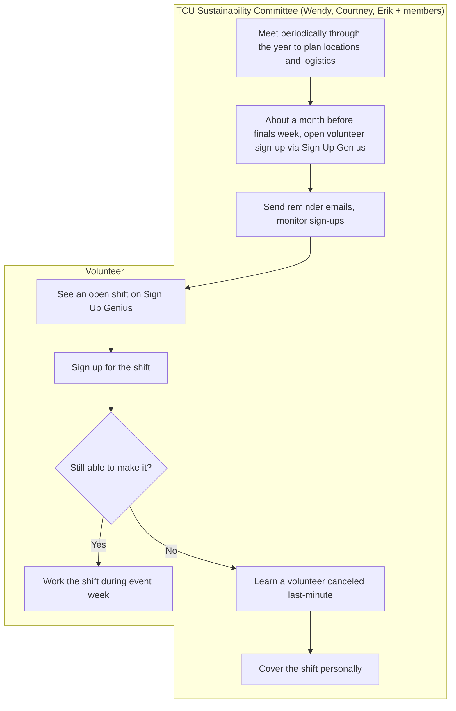
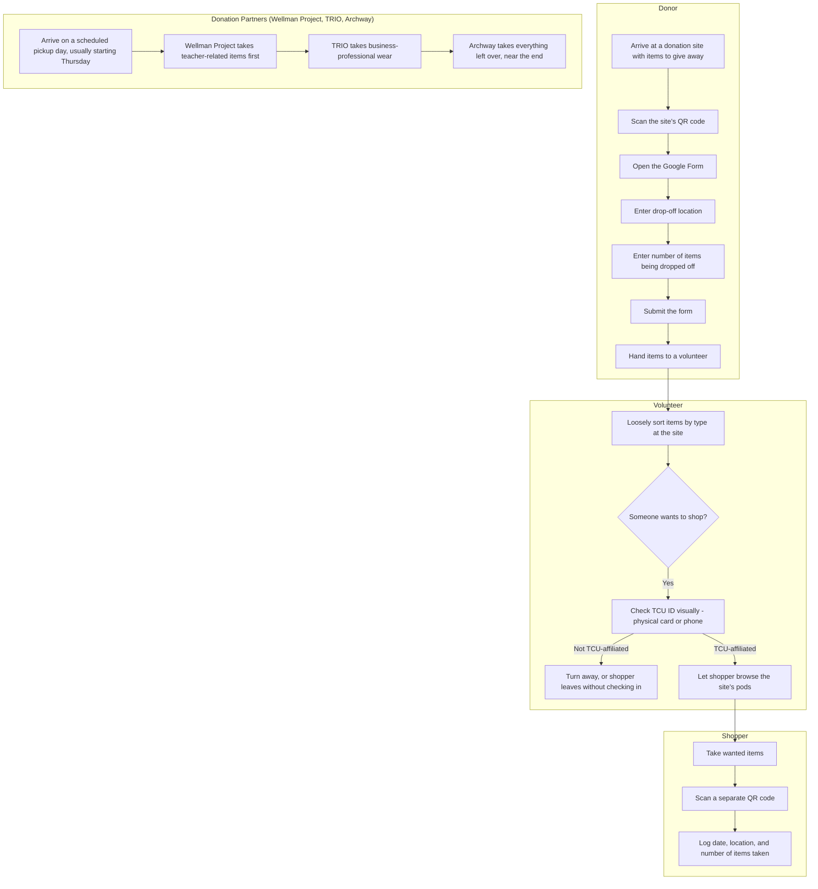
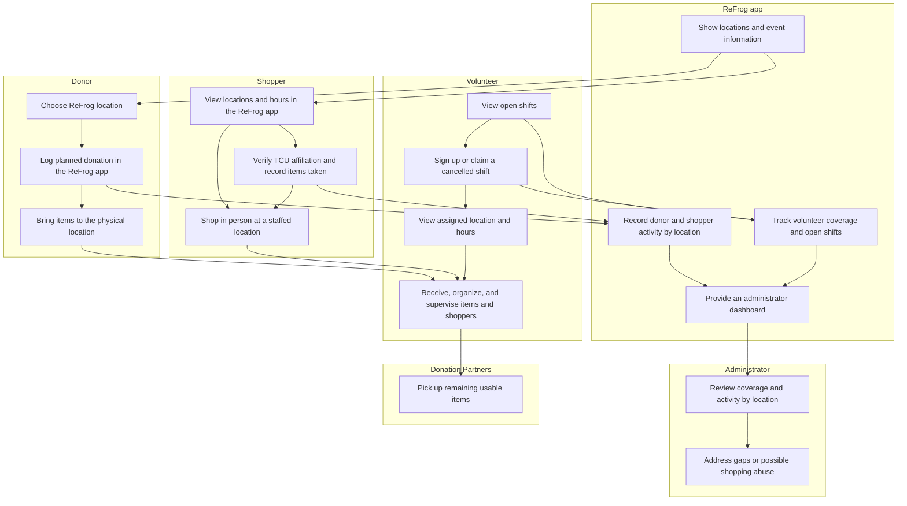

# Vision and Scope

**Project:** _[Refrog]_
**Team:** _[Team 3]_
**Client:** _[Wendy Macias, Texas Christian University]_
**Version:** 0.1

---

_**How to use this template.** Every section below opens with an instruction in italic square brackets: what the section is for, how to produce it, a worked example, and a checklist. Fill in the section underneath the instruction. **Leave the instructions in the file until the document is stable.** They are context for you, for the teammate who writes a later section, and for your AI teammate, which reads this file every time it works on your project._

_**This document has two readers.** Your client has to recognize their own business in it, so avoid jargon they would not use. Your AI teammate has to build from it, so avoid a claim it cannot check. When the two pull against each other, write for the client and put the precision in the use cases._

_**Work it with your agent, not instead of it.** Give the agent this template, your one-page project brief, and your meeting notes, then put it in a role: "You are an experienced business analyst. Using the instructions in this template, draft section X, and list every question you cannot answer from what I gave you." The questions it cannot answer are the point. They go in [OPEN-ISSUES.md](OPEN-ISSUES.md) and they become the agenda for your next client meeting. What the agent cannot do is decide which of its questions deserve your client's limited time, or tell enthusiasm apart from commitment. That judgment is yours._

## Identifiers in this document

_Identifiers here are **name-based slugs**, never numbers._

| Space | Shape | Example |
|---|---|---|
| Business objective | `BO-<slug>` | `BO-grading-time` |
| Success metric | `SM-<slug>` | `SM-submission-rate` |
| Risk | `RI-<slug>` | `RI-cloud-cost` |
| Assumption or dependency | `AS-<slug>` | `AS-client-maintains-stack` |
| Feature | `FEAT-<slug>` | `FEAT-performance-tracking` |

_Coin each slug from the concept itself: short, kebab-case, unique within its space. **Never renumber, rename, or repoint an identifier.** A new item gets a new slug; a retired item keeps its slug and is marked withdrawn. Cite items by identifier, never by position in a list ("the third objective")._

_Why this matters more with an agent than it used to: ask an agent to insert a new objective into a list numbered `BO-1` through `BO-6` and it has two options. Renumber everything, silently breaking every citation in your use cases and your specification, or append out of order. No test you can write detects either one. A slug has neither failure mode, and it tells a reader what the item is at the place it is cited._

## Revision History

| Date | Version | Description | Author |
|---|---|---|---|
| _[YYYY-MM-DD]_ | 0.1 | Initial draft from the client brief and first client meeting | _[Name]_ |

---

## 1. Introduction

_[This document defines the goals, purpose, and boundaries of the project. It gives every stakeholder a shared understanding of what the software is for and the context it operates in: the business problem being solved, how the software fits into the client's world, and where the line falls between what is in scope and what is not.]_

### 1.1 Background

_[Summarize the rationale and context for the new product, or for the changes to an existing one. Describe the situation that led to the decision to build it.]_

_**Step 1: Describe the business.** Introduce the organization. Cover what it does (industry, products, services), its size (employees, locations), and the goals that relate to the problem you are solving._

_Example: "The client, XYZ Logistics, is a mid-sized shipping company that specializes in last-mile delivery services for e-commerce businesses. The company operates in five major cities, employs 200 delivery staff, and handles over 10,000 deliveries per day. The goal is to optimize delivery efficiency and customer satisfaction."_

_**Checklist:** Would a reader who has never heard of this organization understand what it does and why this project exists?]_

ReFrog™ is an entirely volunteer initiative at Texas Christian University (TCU), founded by Courtney Hendrix, Erik Trevino, and Wendy Macias to help TCU reduce move-out waste. It collects usable items that students do not want to keep or cannot take home, including furniture, appliances, clothing, linens, and household goods. These items were historically discarded during move-out; ReFrog redirects them to people who can use them, reducing landfill waste and supporting the community.

Beginning with two donation locations in 2023, ReFrog grew to seven locations by 2025, with an eighth planned for the coming year. According to the client brief, it collected an estimated 48,000-plus items over its first four years; founder Wendy Macias confirmed in the team's first meeting that its most recent event ran on 193 volunteers contributing 520 hours. Its participants include student donors, volunteers, donation and infrastructure partners, university administrative stakeholders, and shoppers. “Shopping” means taking donated items that shoppers can use without charge and is open to TCU students, faculty, staff, and volunteers. This practice evolved as organizers recognized that it helped keep more usable items out of landfills and benefit more people.

As ReFrog has grown, its three founders have managed volunteer scheduling, donation and shopping logs, and TCU-affiliation checks largely by hand, which Wendy Macias says produces an "unknown amount of error" in the numbers the program uses to report its impact. In the team's first meeting with her, she confirmed the project should focus on volunteer sign-up and scheduling first, with TCU ID verification, donation and shopping tracking, and shopping-abuse monitoring to follow — an idea she says was inspired by seeing a donation partner use a similar app to reliably track what it distributes.

Source: *ReFrog™: Helping TCU Reduce Move-out Waste*, client brief for the computer science capstone team; first client meeting with Wendy Macias, September 11, 2026.

### 1.2 Current Process Flows (As-Is Process Flows)

_[Most projects require everyone involved to have a firm grasp of the business process being created, replicated, or improved. Without that understanding there is little chance users adopt the new solution. Process flows are the most effective model for building it.]_

_**Step 1: Diagram the current process.** Draw the process people execute **today**, before your software exists, as a mermaid flowchart with **one subgraph per actor** (roles, departments, existing systems). Show the sequence of activities, the decision points, and the handoffs between actors._

_Diagrams in this project are authored as mermaid inside the Markdown file, never exported from a drawing tool as an image. A picture of a diagram is invisible to your AI teammate and unreadable in a diff; a mermaid block is text it can read and revise. A skeleton to start from:_

    ```mermaid
    flowchart TD
      subgraph Student
        A[Open the shared spreadsheet] --> B[Type last week's activities]
      end
      subgraph Instructor
        C[Review the updated sheets] --> D{Complete?}
        D -- No --> E[Email the student]
        D -- Yes --> F[Enter the grade in the LMS]
      end
      B --> C
    ```

_**Step 2: Write the prose.** Not every reader reads diagrams. Explain the flow in a paragraph underneath it._

_**Step 3: List the current tools.** Enumerate what the process runs on today (spreadsheets, paper schedules, email, a legacy system) and give the limitation of each._

_Example: "XYZ Logistics relies heavily on Excel spreadsheets for order management. Printed delivery schedules are distributed to drivers daily. These tools lack automation, making the process prone to human error and delays."_

_**Step 4: Name the pain points.** Highlight the inefficient, slow, or error-prone steps, using one or two specific examples rather than a general complaint._

_Inefficiency example: "Manual entry of order details into Excel causes delays and transcription errors. During peak season, order entries pile up, delaying processing and delivery."_

_Time example: "Printing and distributing delivery schedules to drivers takes 2 hours daily, cutting into time available for deliveries."_

_**Step 5: Write for an outsider.** Assume your reader knows nothing about this domain. Define every domain term on first use and add it to the [project glossary](project-glossary.md)._

_**Checklist:** Is the business context clear to someone unfamiliar with it? Does the flow give step-by-step detail? Are all actors and tools described? Are the inefficiencies illustrated with specific examples? Is there a mermaid diagram with one subgraph per actor?]_

**Volunteer recruitment & scheduling**



**Event-day donation, shopping, and pickup**



Volunteer scheduling and the event itself run on separate timelines. About a month before finals week, the TCU Sustainability Committee — founders Wendy Macias, Courtney Hendrix, and Erik Trevino, along with a few other members — opens volunteer sign-up through Sign Up Genius and sends reminder emails. When a volunteer cancels close to the date, there is no system to find a replacement automatically; one of the three founders covers the shift personally.

During the event itself (Monday through Saturday of finals week, starting around 2pm), a donor arriving at a site scans a QR code, opens a Google Form, and enters the drop-off location and the number of items being dropped off before handing the items to a volunteer. The volunteer loosely sorts what comes in by type. When someone wants to shop, a volunteer checks their TCU affiliation by eye — a physical card or a phone ID — before letting them browse the site's pods; someone without TCU affiliation is turned away, though catching that depends entirely on the volunteer noticing. A shopper who is let in takes what they want, then scans a separate QR code and logs the date, location, and number of items taken in a second Google Form.

From Thursday on, donation partners arrive on a set order to collect what remains: the Wellman Project takes teacher-related items first, TRIO takes business-professional wear next, and Archway takes everything left over near the end of the week.

**Current tools, and their limitations:**

- **Sign Up Genius** — volunteer scheduling and sign-up. No automated way to fill a shift when someone cancels last-minute; one of the three founders covers it personally.
- **QR code → Google Form (donation)** — logs drop-off location and number of items only, with no item-level description. A couch and a notebook both count as "1 item," so the totals do not reflect real volume or type.
- **QR code → Google Form (shopping)**, a separate form from the donation one — logs date, location, and number of items taken per visit. Nothing links one shopper's visits together, so there is no way to see a pattern of repeated or excessive shopping.
- **Visual TCU ID check** — a volunteer checks a physical or phone ID by eye before letting someone shop. Not recorded anywhere, easy for someone to simply decline to show it, and enforcement depends entirely on the volunteer noticing during a busy period.
- **Google Sheets**, auto-generated from the two Forms — the only source used to report ReFrog's impact at year-end. Reconciled by hand after the event, which is where Wendy Macias says an "unknown amount of error" enters the numbers.
- **Manual headcount of donation-partner truckloads** — dumpsters-diverted and tonnage figures are estimated from memory of how many truckloads each partner took. Not tracked in any form or spreadsheet at all; it is an after-the-fact estimate by the three founders.

**Pain points:**

- Last-minute volunteer cancellations fall entirely on the three founders to absorb personally, which will not scale as ReFrog adds an eighth location next year.
- Counting every item the same way — "a couch is equivalent to a notebook," in Wendy Macias's words — means the totals ReFrog reports do not reflect true volume, which is why she describes the data as having an "unknown amount of error."
- Shopping abuse (a shopper "accumulating hundreds of items," or someone without TCU affiliation shopping) is only ever suspected, never confirmed, because no system links a shopper's visits together.
- Donation-partner handoffs are not tracked at all: Archway said it received fewer usable items than expected even though ReFrog had described the volume in advance, because neither side had real numbers to check the handoff against.

### 1.3 References

_[List every document referenced elsewhere in this one: the client's project brief, existing forms and reports, regulations, standards, competing products. Identify each by title, date, and where it can be obtained. The spreadsheet or screenshot your client showed you belongs here.]_

- **ReFrog™: Helping TCU Reduce Move-out Waste** — client brief for the computer science capstone team, provided before the first meeting.
- **ReFrog Donation Form** (Google Form) — donors log drop-off location and item count; referenced in §1.2. Obtained from Wendy Macias, September 11, 2026. https://docs.google.com/forms/d/e/1FAIpQLSfcGInBK4-Fl2dIWAFvCGyz2Ao5YDikI6DvYOGiOYrml7F_XA/viewform
- **ReFrog Shopping Form** (Google Form) — shoppers log date, location, and item count taken; referenced in §1.2. Obtained from Wendy Macias, September 11, 2026. https://docs.google.com/forms/d/e/1FAIpQLSfd3-MKcCjhyJ3LtwXUyRx-qR6Ott06KG17Ka2QN6PFEqJg-Q/viewform
- **ReFrog Volunteer Sign-In Form** (Google Form) — obtained from Wendy Macias, September 11, 2026. https://docs.google.com/forms/d/e/1FAIpQLSdr6j-Xd1ZMyDPwEJ9AwD7vgFLTZXmA7uoV-PGwWPdX297Mww/viewform
- **Google Form Responses Sheet** (Google Sheet) — aggregated responses from the forms above; the source Wendy Macias reconciles by hand to report ReFrog's year-end impact, referenced in §1.2. Obtained September 11, 2026. https://docs.google.com/spreadsheets/d/1ciADnXltBiOuhxixqcflfXXphSHhaUc7wTqGUY0OHHA/view
- _[Title needed — what does this sheet track?]_ (Google Sheet) — obtained September 11, 2026. https://docs.google.com/spreadsheets/d/1BpwtBPWajHj6jQDZ_XhCY0T-t3ioInGgNj1Vx6CLnKg/view
- **Year-to-Year Comparison Sheet** (Google Sheet) — cumulative metrics comparing each year of ReFrog's operation. Obtained September 11, 2026. https://docs.google.com/spreadsheets/d/1lqYD15tJUPqRsM40l8BN6dHLbyBUlsOK/edit?gid=1442495151#gid=1442495151

---

## 2. Business Requirements

_[Projects are launched in the belief that creating or changing a product will provide worthwhile benefits for someone. Business requirements describe the primary benefits the new system will provide to its sponsors, buyers, and users. Input comes from the people who know **why** the project is being undertaken: your client, their management, a subject matter expert, a product visionary. Business requirements determine which user requirements get implemented and in what order, so take this section seriously.]_

### 2.1 Business Opportunity or Problem Statement

_[State the problem being solved or the opportunity being exploited, in the client's own terms. One or two paragraphs. This is the answer to "why is anyone paying for this?"]_

ReFrog is a volunteer-run program, founded and led by Wendy Macias along with Courtney Hendrix and Erik Trevino, that collects usable items TCU students discard during move-out and gets them into the hands of people who can use them, instead of the landfill. It has grown to 7 donation sites (8 planned for the coming year), and in its most recent event ran on roughly 193 volunteers and 520 volunteer hours while handling thousands of donated items and around 9,600 shopped items.

The donation and shopping process already runs on lightweight tools — a QR-code-linked Google Form for logging drop-offs and pickups, Sign Up Genius for volunteer scheduling — but these tools are disconnected and, in Wendy's own words, produce an "unknown amount of error" in the counts the program depends on to report its impact. TCU affiliation is checked by eye rather than verified, there is no way to notice when a shopper is taking far more than a fair share, and volunteer scheduling is managed by hand by the three founders whenever someone cancels last-minute. Wendy's own inspiration came from seeing a donation partner use an app to reliably track and value what it distributes — she wants something similar for ReFrog, without changing the structure of the event itself.

### 2.2 Business Objectives

_[Summarize the business benefits the product will provide, **quantitatively and measurably**. Platitudes ("become recognized as a world-class provider") and vague improvements ("provide a more rewarding customer experience") are neither helpful nor verifiable.]_

_Examples:_

- _`BO-grading-time`: Reduce the instructor's time to grade peer evaluations by 50%._
- _`BO-submission-rate`: Increase the weekly activity report and peer evaluation submission rate by 20%._
- _`BO-student-effort`: Reduce the time a student spends completing a weekly activity report and peer evaluation by 25%._

_ReFrog Business objectives:_

- _`BO-number-of-volunteers`: Increase the number of volunteers by 10%._
- _`BO-number-of-volunteer-hours`: Increase the number of volunteer hours by 15%._
- _`BO-organizations-working-with`: Increase the number of organizations ReFrog works with by 1._
- _`BO-organizers-time-saved`: Reduce the time ReFrog organizers need to set up by XX%_  
- _`BO-accurate-data`: Increase the accuracy of the data collected by XX%._
- _`BO-number-of-items`: Increase the number of items donated by 20%._
- _`BO-money-saved`: Increase the money saved from paying for dumpsters by 15%._

_**How to elicit these.** Clients rarely volunteer numbers. Ask: What business problem are you trying to solve? What is the motivation for solving it now? What would a highly successful solution do for you? What is a successful solution worth? If the answer contains no number, ask what the number is today._

_**Checklist:** A year from now, could someone tell whether each objective was met? Does each one contain a quantity?]_

### 2.3 Success Metrics

_[Business objectives say what should improve. Success metrics tell you **whether you are on track to get there**, and they can be measured far sooner. That gap is the reason this section exists. A business objective often cannot be measured until well after the project ends, and sometimes depends on projects beyond yours, but you still need to know during the semester whether you are heading the right way.]_

_Specify the indicators stakeholders will use to define and measure success on this project. Identify the factors with the greatest impact on achieving it, including factors outside the organization's control._

_A success metric is sometimes the same statement as a business objective, when the objective happens to be measurable early. "Reduce time spent ordering chemicals to 10 minutes on 80 percent of orders" serves as both, because average order time can be measured during testing or shortly after release. Where an objective is measured a year out, write a metric that tracks the same thing on a shorter timeline: against an adoption objective measured annually, "track 60 percent of commercial chemical containers and 50 percent of proprietary chemicals within 4 weeks"._

_For each metric give the indicator, where the number comes from, what it is today (the baseline), and what counts as success by when. A metric with no baseline is not measurable, and "we do not track that today" is a finding worth recording rather than a gap to paper over._

_Examples:_

- _`SM-cafeteria-adoption`: 75% of employees who used the cafeteria at least 3 times per week during Q3 2013 use the Cafeteria Ordering System at least once a week, within 6 months following initial release._
- _`SM-satisfaction`: The average rating on the quarterly cafeteria satisfaction survey increases by 0.5 on a scale of 1 to 6 from the Q3 2013 rating within 3 months following initial release, and by 1.0 within 12 months._

_**How to elicit these.** Ask "how will you know this worked?", then ask what that number is today. If your client cannot say, ask who would know and whether the number is recorded anywhere. Clients often propose a metric the software cannot influence (revenue, headcount); trace it back to something your system actually changes._

_**Choose your success metrics wisely. Make sure they measure what is important to the business, not just what is easy to measure.** "Reduce product development costs by 20 percent" is easy to measure, and also easy to achieve by laying off employees or investing less in innovation, neither of which is the intended outcome. Prefer a metric that gets worse if you build the wrong thing._

_**Checklist:** Does each metric name its source, its baseline, and its deadline? Can this software actually move it? Can it be measured during testing or shortly after release, rather than a year later? Does every business objective have at least one metric behind it, and does every metric trace back to an objective?]_

### 2.4 Vision Statement

_[One statement summarizing, at the highest level, the position this product intends to fill. Fill in the table.]_

| | |
|---|---|
| **For** | _[student donors, shoppers, volunteers, and ReFrog's organizers]_ |
| **Who** | _[need an easier way to sign up for volunteer shifts and cover last-minute cancellations, verify TCU affiliation, and see reliable numbers on donations and shopping instead of piecing them together by hand]_ |
| **The** _[ReFrog app]_ | _[is a mobile-first application (exact platform not yet finalized, see `OI-1`)]_ |
| **That** | _[lets volunteers sign up and get notified when a shift opens, lets organizers verify TCU affiliation and flag unusual shopping activity, and brings donation, shopping, and volunteer data into one dashboard]_ |
| **Unlike** | _[the current process of signing volunteers up through Sign Up Genius and logging donations and shopping through separate, disconnected Google Forms, reconciled by hand]_ |
| **Our product** | _[consolidates volunteer sign-up, donation logging, and shopping activity into one system, cutting down the "unknown amount of error" in the numbers ReFrog reports]_ |

_Worked example:_

| | |
|---|---|
| **For** | _students in the TCU senior design course_ |
| **Who** | _need an easier way to submit and update weekly activity reports and peer evaluations_ |
| **The** _Project Pulse_ | _is a web application_ |
| **That** | _lets students submit reports and evaluations in one place, and lets instructors view and grade them without downloading anything_ |
| **Unlike** | _the current process of spreadsheets and manual uploads to the learning management system_ |
| **Our product** | _keeps the whole cycle in one system, so nothing is transcribed by hand_ |

_**Use this in the meeting.** Read the filled-in table back to your client out loud and watch what they correct. It is the fastest way to discover you misunderstood the project, and it costs ninety seconds. Corrections go straight into [OPEN-ISSUES.md](OPEN-ISSUES.md)._

### 2.5 Proposed Process Flows (To-Be Process Flows)

_[Draw the improved process, with your software in it, as a second mermaid flowchart in the same shape as the as-is flow. Show how the software interacts with each actor, which steps it automates, and which pain point from section 1.2 each change addresses. Label the steps that are new or significantly changed, and say plainly which manual steps **remain** and why. There may be several major flows.]_

_The point of drawing both is the comparison. If the two diagrams look alike, either you have not understood the current process or the software is not worth building._



The ReFrog app would replace separate QR-code Google Forms and SignUpGenius for the parts of the event that participants report themselves. Donors would select a drop-off location and log their donation; shoppers would see location information, verify their TCU affiliation, and record items taken. Volunteers would sign up for shifts, see their assigned locations, and be able to claim newly open shifts after cancellations. Administrators would use the dashboard to review volunteer coverage, donation and shopping activity by location, and potential abuse so they can respond before the next day.

The physical event remains in person. Volunteers still receive items, keep the capsules safe and organized, check shoppers, manage crowd flow, and encourage usable items to be donated rather than discarded; these tasks require a staffed presence at each location. Donation partners still collect items remaining after shopping. The proposed changes address the manual effort of covering cancelled shifts, the scattered location information, and the error-prone data collected through short QR-code forms.

### 2.6 Risks

_[Summarize the major business risks of building this product, and of not building it. Categories include competition, timing, user acceptance, implementation, and negative impact on the business. Business risks are not project risks: "a teammate might drop the course" is a project risk and does not belong here. Give probability and impact for each, and a mitigation where you have one.]_

_**State risks as mechanisms, not categories.** "Security risk" names a category and tells nobody anything. "The peer evaluation database holds student grades, is reachable from the public internet, and has no rate limiting" names a mechanism someone can act on._

Probability is rated from 0.0 to 1.0. Impact is rated from 0 (no consequence) to 10 (severe disruption) and describes the consequence for ReFrog's participation, operations, or continuity. These ratings are preliminary estimates for client review, not measured values.

| Identifier | Business risk | Probability | Impact | Proposed mitigation |
|---|---|---:|---:|---|
| `RI-participation-friction` | Requiring downloads, account creation, or detailed item entry could discourage participation. If donating becomes more difficult, students may discard usable items instead. | 0.5 | 9 | Keep participation steps short, test them with representative users, and evaluate browser/QR access before requiring installation. Introduce additional donation fields only if they remain quick to complete. |
| `RI-volunteer-shortfalls` | Open shifts and last-minute cancellations may continue despite improved scheduling, leaving locations understaffed and requiring organizers to cover gaps. Software alone cannot ensure sufficient volunteer recruitment. | 0.8 | 9 | Make staffing gaps visible, simplify cancellation and replacement signup, and support reminders and recruitment outreach. Retain an organizer-led process for urgent coverage. |
| `RI-unreliable-impact-data` | Self-reported counts, incomplete submissions, and estimated partner pickups may produce misleading totals, weakening planning and the evidence used to communicate ReFrog's impact or seek funding. | 0.8 | 8 | Agree on metric definitions, distinguish reported counts from estimates, and document calculation methods. Verify historical figures before using them as baselines. |
| `RI-event-disruption` | If the system becomes unavailable or difficult to use during finals-week activity, volunteers may lose access to schedules or instructions, disrupting already busy locations. | 0.4 | 9 | Validate essential workflows before the event and provide an accessible backup of schedules, location information, and attendance procedures. |
| `RI-undetected-shopping-abuse` | If future shopping monitoring fails to identify excessive or otherwise prohibited shopping, abuse may continue and reduce the items available to other participants. | 0.6 | 8 | Define shopping abuse with the client and provide administrators with enough information to review concerning activity. Review missed cases to improve detection while keeping enforcement decisions with administrators. |
| `RI-incorrect-shopping-penalties` | If future shopping monitoring misclassifies legitimate volunteer activity as shopping abuse, innocent volunteers may be flagged or penalized, damaging trust and discouraging participation. | 0.5 | 8 | Distinguish volunteer actions from personal shopping, require administrator review before penalties, and provide a process to correct misclassified activity and reverse incorrect penalties. |
| `RI-operational-transition` | If volunteers and organizers continue using different combinations of the new system, SignUpGenius, forms, and email, conflicting schedules and duplicate records could increase administrative work. | 0.5 | 6 | Agree on the authoritative source for each workflow, pilot the transition, and provide clear training and fallback procedures. |
| `RI-service-continuity` | If maintenance and support lapse after handoff, ReFrog may lose access to essential scheduling, communications, or historical records, disrupting future events and increasing organizers' manual workload. | 0.5 | 9 | Validate the ownership and onboarding arrangements described in `AS-operational-ownership` before operational reliance on the system. |
| `RI-status-quo-growth` | If ReFrog continues without improvements to its current tools or processes, manual coordination and fragmented reporting may become harder to sustain as locations and participation grow. | 0.8 | 8 | Prioritize volunteer coordination and centralized information, whether delivered through the new system or improvements to existing tools. |

### 2.7 Business Assumptions and Dependencies

_[An assumption is something you believe without proof, which would force this document to change if it turned out false. A dependency is something outside your control that the project relies on. Both live here under `AS-*`.]_

_**Checklist:** For each assumption, what happens to this project if it is false? If the answer is "nothing", it is not worth recording. If the answer is "we start over", raise it with your client this week._

| Identifier | Type | Statement | Consequence if false or unavailable |
|---|---|---|---|
| `AS-volunteer-first` | Assumption | The initial release will prioritize volunteer signup, attendance, scheduling information, and administrator coordination, consistent with the September 17 notes. Broader donation and shopping capabilities require separate prioritization. | The release scope, acceptance criteria, and delivery plan must be revised. |
| `AS-existing-program` | Assumption | ReFrog will retain its existing in-person donation and shopping model. The system will support that process while keeping participation simple and preserving ReFrog branding. | A substantial change to the operating model would require new workflows and requirements. |
| `AS-client-materials` | Dependency | The client will provide available historical reports from past ReFrog events, approved branding materials, and current volunteer instructions. Existing signup schedules and donation/shopping forms may also be shared as references, but their availability is not a prerequisite for designing improved workflows. | Historical comparisons, branding approval, and validation of volunteer guidance may be delayed or limited. |
| `AS-event-configuration` | Dependency | Organizers will confirm event dates, operating hours, locations, shift lengths, and staffing needs before volunteer registration opens. | The system cannot publish a reliable schedule or location guide. |
| `AS-participant-access` | Assumption | Most intended users will have access to a suitable device and sufficient connectivity to use the selected delivery channel at event locations. This has not yet been validated. | Assisted access, browser access, or offline/manual fallback procedures may be necessary. |
| `AS-authentication-approach` | Dependency | The current identification and verification process uses in-person TCU ID checks and the relevant Google Forms. The client and team will determine whether the new system retains these methods, supplements them, or uses another electronic approach. No specific electronic login provider has been selected. | Account access, participant onboarding, and verification workflows cannot be finalized until the approach is agreed upon. |
| `AS-affiliation-verification` | Dependency | Any new electronic approach must provide evidence of TCU affiliation that the client accepts. Its feasibility depends on the availability of any required university resources or approvals. Existing in-person TCU ID checks and relevant Google Forms remain the baseline process unless an alternative is agreed upon. | If an acceptable electronic method is unavailable, the system must accommodate the existing verification process. |
| `AS-client-policy-decisions` | Dependency | The committee will define relevant rules, including volunteer cancellation and attendance procedures and, if shopping features enter scope, participant eligibility and acceptable shopping behavior. | Affected workflows and restrictions cannot be finalized reliably. |
| `AS-operational-ownership` | Dependency | Before handoff, ReFrog or a designated university group will identify a maintenance owner who can participate in onboarding and assume responsibility for service accounts, recurring costs, and ongoing support. | The proposed deployment and long-term handoff may not be sustainable. |
| `AS-seasonal-readiness` | Dependency | Organizers will confirm when the system must be ready for recruitment, which the transcript places approximately one to one-and-a-half months before the finals-week event, and participate in validation before that date. | ReFrog may need to retain its existing signup process for the next event. |

---

## 3. Stakeholder Profiles and User Descriptions

_[To build something that meets real needs you have to identify everyone with a stake in the outcome, and confirm that the users are actually represented among them. This section records **who they are and why they care**, not their specific requests, which belong in the use cases.]_

_A stakeholder is not always a user. The person paying for the software, the person who maintains it after you graduate, and the person whose job changes because of it all have a stake and may never log in._

### 3.1 Stakeholder Profiles

| Stakeholder | Major value or benefit from this product | Attitude | Major features of interest | Constraints | End user? |
|---|---|---|---|---|---|
| _[Role]_ | _[What they get out of it]_ | _[Supportive, skeptical, unaware, opposed]_ | _[What they care about]_ | _[What limits them]_ | _[Yes or no]_ |

_**Attitude is the column students leave blank, and the one that predicts trouble.** A stakeholder whose workload increases because of your software is not automatically supportive, and finding that out in December is too late._

### 3.2 User Environment

_[Describe the working environment of the target users:_

- _How many people are involved in completing the task? Is that changing?_
- _How long is a task cycle, and how much time goes into each activity? Is that changing?_
- _Any environmental constraints: mobile, outdoors, noisy, gloved hands, poor connectivity?_
- _Which platforms are in use today, and which are planned?_
- _What other applications are in use, and does yours have to integrate with them?]_

### 3.3 Alternatives and Competition

_[Identify the alternatives your stakeholders see as available: buying a competitor's product, building something in-house, or keeping the status quo. Give the major strengths and weaknesses of each **as the stakeholder perceives them**, not as you do.]_

| Alternative | Strengths | Weaknesses for this client |
|---|---|---|
| _[Tool, or "the current manual process"]_ | | |
| The current manual process: SignUpGenius, QR-code Google Forms, the ReFrog website and Google Map, email, and organizer coordination | This is familiar to the organizers, keeps donor and shopper forms short, and has worked reasonably well for volunteer recruitment and sharing location information. | Courtney, Eric, and Wendy must manually cover cancelled shifts; they see an unknown amount of error in the counts; and they do not have one place to review location activity or possible shopping abuse. |
| Build a mobile-friendly ReFrog application in-house | Wendy sees an app as a way to make ReFrog easier for people to use from their phones and to put volunteer sign-up, locations, participation, and event data in one place. | Volunteers, shoppers, and donors would need to know about the application and be able to easily use the app during the event. |

_Always include the status quo as a row. It is the alternative that wins most often, and the one your product actually has to beat._

---

## 4. Scope and Limitations

_[The section you will cite most often. Scope is what keeps a friendly client's good ideas from consuming your semester. When a new request arrives in October, this is what you point at.]_

### 4.1 Product Perspective

_[Put the product in context relative to other systems and the user's environment. If it is independent and self-contained, say so. If it is one component of something larger, describe how they interact and identify the interfaces between them. A context diagram shows this most clearly: your system as one box, every external actor and system around it, and a labeled arrow for each thing that crosses the boundary.]_

    ```mermaid
    flowchart LR
      Student[Student] --> PP[Project Pulse]
      Instructor[Instructor] --> PP
      PP --> Gmail[(Gmail)]
      PP --> LMS[(Learning management system)]
    ```

### 4.2 Major Features and Scope

_[List and briefly describe the major product features. A feature is a high-level **capability** the system provides in order to deliver a benefit: an externally visible service, not an implementation detail.]_

_Because this document is read by a wide range of people, keep the detail general enough for everyone to follow while giving your team enough to build a use-case model from. **Use cases are derived from these features**, so a feature too vague to decompose is too vague._

_Guidelines:_

- _State features at the level of product capabilities._
- _One to three sentences each._
- _No detailed workflows, user interface behavior, or algorithms._
- _Do not describe how the feature will be implemented._
- _Focus on what capability is needed and why, not how._
- _Understandable by a non-technical stakeholder, including your client._

_Examples:_

- _`FEAT-administration`: Manage senior design sections, teams, and student rosters._
- _`FEAT-performance-tracking`: Submit and review weekly activity reports and peer evaluations._
- _`FEAT-grade-generation`: Generate weekly activity report and peer evaluation grades for an entire section._

- _`FEAT-volunteer-scheduling`: Manage volunteer sign up, cancellations, view hours_
- _`FEAT-identity-verification`: verify tcu affiliation for shoppers that are students/faculty/staff_
- _`FEAT-location-info`: view donation location,hours, and general information_
- _`FEAT-adminstration`: Admin can view dashboards about event data._
- _`FEAT-shopping-monitoring`: Admins receive alerts about potential shopping abuse_
**- _`FEAT-shopping`: volunteers/shoppers add items that were shopped._
- _`FEAT-donation`: Donators add items that were donated at each location._
- _`FEAT-volunteer-notification`: Volunteers receive notifications about shifts and sign up._
**- _`FEAT-donation-partners`: Donation partners can view general information and items at locations._


### 4.3 MVP Scope

_[Of the features above, which ones ship in the release you actually deliver in December? Name them by identifier. Then name what is explicitly **out**, also by identifier, so it is on the record.]_

_**In scope for the MVP:** `FEAT-...`, `FEAT-...`_

_**Explicitly out of scope:** `FEAT-...` (reason), `FEAT-...` (reason)_

_Ask your client the question directly: "If we can deliver only one of these in December, which one is it?" The answer is worth more than the rest of the meeting. A client who cannot choose has not thought about it yet, which is itself something you need to know now rather than in November._

### 4.4 Deployment Considerations

_[Summarize what it takes to get this into its operating environment. How will users reach it? Are they spread across locations or time zones? What infrastructure has to change for capacity, network access, data storage, or data migration? Who trains the users? Who maintains it after this team graduates, and what does that person already know how to run?]_

_That last question shapes your architecture, so ask it in the first client meeting rather than the last._
